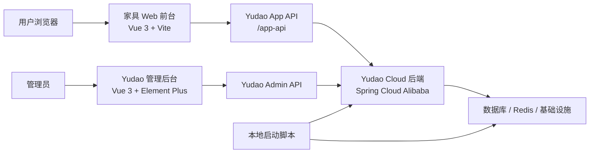

# Furniture Workspace

这是一个家具电商组合工程，包含家具商城前台、Yudao 电商后台、Yudao 后端服务和本地开发工具链。仓库外层 README 用作项目总入口，负责说明工程结构、核心功能、业务流程、启动方式和详细文档索引。

## 目录

- [项目介绍](#项目介绍)
- [系统组成](#系统组成)
- [功能模块](#功能模块)
- [核心业务流程](#核心业务流程)
- [技术架构](#技术架构)
- [快速启动](#快速启动)
- [开发与测试](#开发与测试)
- [文档索引](#文档索引)
- [目录说明](#目录说明)
- [常见问题](#常见问题)

## 项目介绍

本项目的目标是把一个家具商城前台与 Yudao 电商能力进行联调整合：

- 用户在家具 Web 前台浏览商品、加入购物车、登录、结算并查看订单。
- 管理员在 Yudao 管理后台维护商品、订单、会员和系统配置。
- Yudao 后端提供商品、会员认证、购物车、地址、结算、订单等 App API。
- 本地脚本和工具目录提供 JDK、Maven、基础设施启动等开发支持。

外层 README 不替代每个子项目的详细 README，而是作为 GitHub 首页的项目说明书和索引入口。

## 系统组成

| 目录 | 说明 | 主要技术 |
| --- | --- | --- |
| `furniture web/` | 家具商城前台，包含 RH 风格页面、商品列表/详情、购物车、结算、订单和 Yudao App API 集成 | Vue 3, Vite, Vitest |
| `yudao电商管理平台前后端/yudao-cloud/` | Yudao Cloud 后端，提供商城、会员、支付、订单、基础设施等微服务能力 | Java 8, Spring Boot 2.7, Spring Cloud Alibaba, Maven |
| `yudao电商管理平台前后端/yudao-ui-admin-vue3/` | Yudao 管理后台前端，用于维护商品、订单、会员、系统配置等后台数据 | Vue 3, Vite, Element Plus, TypeScript, pnpm |
| `tools/` | 本地开发用 JDK、Maven 等工具依赖 | JDK 8, Maven |
| `start-yudao-infra.ps1` | 启动 Yudao 本地基础设施 | PowerShell, Docker |
| `start-yudao-backend.ps1` | 配置本地 JDK/Maven 并启动 Yudao 后端 | PowerShell, Maven |

## 功能模块

### 家具商城前台

`furniture web/` 是用户侧商城前台，目前包含：

- 页面浏览：首页、促销页、户外页、沙发列表页、沙发详情页、青少年页、儿童页。
- 商品展示：支持本地 demo 商品，也支持从 Yudao 商品接口读取商品列表和详情。
- 购物车：支持本地购物车持久化；登录或远程商品场景下可同步 Yudao 购物车。
- 用户认证：支持短信登录、密码登录、token 存储、token 刷新和退出登录。
- 结算下单：支持读取默认地址、订单结算预览和创建订单。
- 订单查看：支持订单列表和订单详情展示。
- 联调配置：默认连接 `http://127.0.0.1:48080/app-api`，也可通过 `VITE_YUDAO_APP_API_BASE` 覆盖。

### Yudao 后端服务

`yudao-cloud/` 是 Yudao Spring Cloud 后端，承担业务 API 和基础能力：

- 商品服务：SPU/SKU、商品上下架、商品详情、商城商品列表。
- 会员服务：会员登录、短信验证码、token 刷新、会员地址。
- 交易服务：购物车、订单结算、订单创建、订单查询。
- 支付与订单能力：支付订单、退款、交易订单状态流转。
- 系统与基础设施：权限、配置、日志、文件、消息、定时任务等。

### Yudao 管理后台

`yudao-ui-admin-vue3/` 是后台管理前端，主要用于：

- 商品维护：创建和编辑商品 SPU/SKU、价格、库存、图片、上下架状态。
- 订单管理：查看订单、处理交易相关信息。
- 会员管理：维护会员、地址、账号相关数据。
- 系统管理：菜单、角色、权限、字典、配置等后台基础能力。
- 开发验证：支持 TypeScript 检查、不同环境构建和前端 lint/format。

### 前后端联调

家具 Web 与 Yudao 的联调集中在 `furniture web/src/services/yudaoClient.js`：

- 统一配置 Yudao App API base URL。
- 统一处理 `CommonResult` 响应解包和错误提示。
- 登录后自动携带 `Authorization: Bearer <token>`。
- 认证失败时尝试 refresh token，失败后清理本地会话。
- 对商品、购物车、地址、结算、订单响应做前台展示用的数据映射。

## 核心业务流程

### 商品上架到前台展示

1. 启动 Yudao 基础设施、后端和管理后台。
2. 管理员登录 Yudao 管理后台。
3. 在商城商品模块创建或编辑商品 SPU/SKU。
4. 配置商品名称、封面图、轮播图、简介、详情、价格、库存等信息。
5. 将商品设置为上架状态。
6. 家具 Web 前台访问 `/sofas-plp` 或商品详情页。
7. 前台调用 Yudao 商品接口，将后端商品数据映射为前台商品卡片和详情展示。

### 用户登录流程

1. 用户在家具 Web 前台打开登录/注册弹窗。
2. 选择短信登录或密码登录。
3. 前台调用 Yudao 会员认证接口。
4. 登录成功后保存 access token、refresh token 和过期时间。
5. 后续请求自动携带 bearer token。
6. 如果接口返回认证失败且存在 refresh token，前台尝试刷新 token。
7. 刷新失败时清理本地会话，用户需要重新登录。

### 购物车流程

1. 用户浏览商品并点击加入购物车。
2. 如果商品来自 Yudao 且远程购物车可用，前台调用 Yudao 购物车接口。
3. 如果远程接口失败，前台回退到本地购物车。
4. 用户可以修改数量、删除商品和打开购物车抽屉。
5. 本地购物车会持久化到浏览器存储；远程购物车会从 Yudao 重新拉取。

### 结算下单流程

1. 用户从购物车进入 `/checkout`。
2. 前台读取结算商品和用户 token。
3. 如果商品和登录状态满足远程结算条件，调用 Yudao 订单结算接口。
4. 前台读取默认地址或地址列表。
5. 用户确认结算信息后创建订单。
6. 创建成功后跳转到订单页面或订单详情。
7. 如果不满足远程结算条件，本地 demo 商品仅展示本地结算预览，不调用真实下单接口。

### 本地开发流程

1. 启动 Yudao 基础设施。
2. 启动 Yudao 后端。
3. 启动 Yudao 管理后台，维护商品和基础数据。
4. 启动家具 Web 前台。
5. 在前台完成登录、商品浏览、购物车、结算、订单等联调。
6. 运行测试、构建和 harness 检查。

## 技术架构



## 快速启动

### 家具 Web 前台

```powershell
cd "D:\code\furniture web"
npm.cmd install
npm.cmd run dev
```

默认 Yudao App API 地址：

```text
http://127.0.0.1:48080/app-api
```

如需覆盖：

```powershell
$env:VITE_YUDAO_APP_API_BASE="http://127.0.0.1:48080/app-api"
npm.cmd run dev
```

### Yudao 本地基础设施

```powershell
cd "D:\code"
powershell -ExecutionPolicy Bypass -File .\start-yudao-infra.ps1
```

如需重新导入本地 SQL：

```powershell
powershell -ExecutionPolicy Bypass -File .\start-yudao-infra.ps1 -ReimportSql
```

### Yudao 后端

```powershell
cd "D:\code"
powershell -ExecutionPolicy Bypass -File .\start-yudao-backend.ps1 -VerifyOnly
powershell -ExecutionPolicy Bypass -File .\start-yudao-backend.ps1
```

该脚本会使用仓库内的 `tools/jdk8` 和 `tools/maven`，并打包运行 `yudao-server`。

### Yudao 管理后台

```powershell
cd "D:\code\yudao电商管理平台前后端\yudao-ui-admin-vue3"
pnpm install
pnpm dev
```

Yudao 管理后台要求：

- Node.js `>= 20.19.0`
- pnpm `>= 8.6.0`

## 开发与测试

### 家具 Web

```powershell
cd "D:\code\furniture web"
npm.cmd test
npm.cmd run build
powershell -ExecutionPolicy Bypass -File harness/phase-b/run-harness.ps1
```

Phase B harness 会检查：

- Git 改动是否在允许范围内。
- 预先存在的脏文件是否被确认。
- `npm.cmd test` 是否通过。
- Vite 是否能构建到临时目录。

### Yudao 后端

```powershell
cd "D:\code"
powershell -ExecutionPolicy Bypass -File .\start-yudao-backend.ps1 -VerifyOnly
```

该命令用于确认本地 JDK、Maven 和后端目录配置是否正确。

### Yudao 管理后台

```powershell
cd "D:\code\yudao电商管理平台前后端\yudao-ui-admin-vue3"
pnpm ts:check
pnpm build:local
```

## 文档索引

### 家具 Web 文档

- [家具 Web Phase B Harness](furniture%20web/harness/phase-b/README.md)
- [家具 Web 页面清单](furniture%20web/docs/page-inventory.md)
- [Yudao 集成开发指南](furniture%20web/docs/yudao-integration/development-guide.md)
- [本地认证后端与数据库安全运行手册](furniture%20web/docs/yudao-integration/local-auth-backend-db-safety-runbook.md)
- [商业集成工程设计](furniture%20web/docs/yudao-integration/commercial-integration-engineering-design.md)
- [认证 API 合同与端到端检查清单](furniture%20web/docs/yudao-integration/auth-api-contract-and-e2e-checklist.md)
- [代码边界安全说明](furniture%20web/docs/yudao-integration/code-boundary-safety.md)

### Yudao 文档

- [Yudao Cloud 后端 README](yudao电商管理平台前后端/yudao-cloud/README.md)
- [Yudao Vue3 管理后台 README](yudao电商管理平台前后端/yudao-ui-admin-vue3/README.md)
- [Yudao 本地基础设施 README](yudao电商管理平台前后端/yudao-cloud/script/docker/README-local-infra.md)
- [Yudao SQL 工具 README](yudao电商管理平台前后端/yudao-cloud/sql/tools/README.md)
- [Yudao DB2 SQL README](yudao电商管理平台前后端/yudao-cloud/sql/db2/README.md)

### Yudao 原项目内的前端 README

- [yudao-ui-admin-vue3](yudao电商管理平台前后端/yudao-cloud/yudao-ui/yudao-ui-admin-vue3/README.md)
- [yudao-ui-admin-vue2](yudao电商管理平台前后端/yudao-cloud/yudao-ui/yudao-ui-admin-vue2/README.md)
- [yudao-ui-admin-vben](yudao电商管理平台前后端/yudao-cloud/yudao-ui/yudao-ui-admin-vben/README.md)
- [yudao-ui-admin-uniapp](yudao电商管理平台前后端/yudao-cloud/yudao-ui/yudao-ui-admin-uniapp/README.md)
- [yudao-ui-mall-uniapp](yudao电商管理平台前后端/yudao-cloud/yudao-ui/yudao-ui-mall-uniapp/README.md)

## 目录说明

- `tools/` 下有 JDK、Maven 自带 README，它们属于本地工具说明，不是业务项目文档。
- `dist/`、`node_modules/`、`captures/`、`logs/` 通常是构建、依赖、截图或日志产物，不建议作为主要代码改动提交。
- 家具 Web 与 Yudao 的联调优先参考 `furniture web/docs/yudao-integration/` 下的文档。
- Yudao 原 README 内容较长，外层 README 只保留总览和入口，细节以子项目 README 为准。

## 常见问题

### GitHub 首页为什么没有显示新版 README？

GitHub 仓库首页读取默认分支 `main` 上的根目录 `README.md`。如果只在本地修改，或者只提交到其它分支，GitHub 首页不会更新。需要把根 README 提交并推送到 `main`。

### 家具 Web 没有自己的根 README 吗？

`furniture web/` 目录目前没有独立根 README，但有多份文档分布在 `docs/` 和 `harness/phase-b/` 下。外层 README 已经把这些关键文档集中索引。

### Yudao README 需要全部复制到外层吗？

不建议。Yudao 后端和管理后台 README 内容很长，适合保留在各自目录。外层 README 负责讲清楚系统关系、业务流程和入口链接，避免 GitHub 首页过长。

### 前台调用哪个后端地址？

默认调用 `http://127.0.0.1:48080/app-api`。本地开发时可以通过 `VITE_YUDAO_APP_API_BASE` 指定其它地址。
