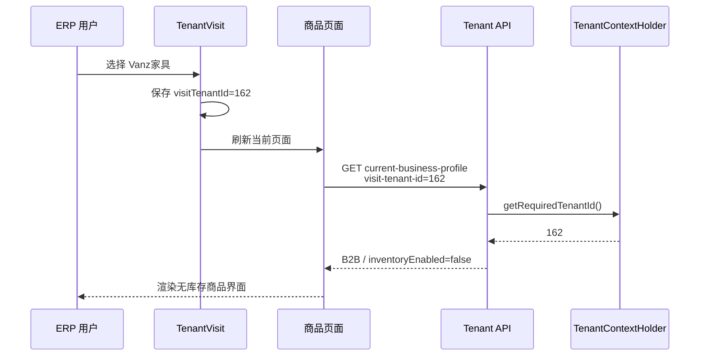

# ERP 按租户业务模式切换商品字段——开发设计

> 状态：待开发
>
> 日期：2026-07-24
>
> 代码库：`D:\code`
>
> 目标分支：`codex/agent-rag`

## 1. 背景与目标

同一套 Yudao ERP 同时服务两类网站：

- Oakved家具：租户 ID `121`，ToC/B2C 零售型，需要库存能力。
- Vanz家具：租户 ID `162`，ToB/B2B 询盘型，商品不应显示库存信息。

ERP 已经支持在右上角切换访问租户，但商品列表、SKU 表单和详情页的库存字段目前固定显示。本次改造的目标是：

1. 给租户增加显式的 `B2B/B2C` 业务模式。
2. 切换租户后，商品页面根据当前有效租户自动切换字段。
3. Vanz 隐藏库存相关 UI，Oakved 保持现状。
4. 不在前端硬编码租户 ID。
5. 不删除共享商品模型中的库存字段，不破坏 ToC 下单、ERP 同步和促销模块。

## 2. 当前实现依据

### 2.1 租户切换链路已经存在

前端组件：

`yudao电商管理平台前后端/yudao-ui-admin-vue3/src/layout/components/TenantVisit/index.vue`

切换租户时会：

1. 调用 `setVisitTenantId(id)`。
2. 关闭其他标签页。
3. 刷新当前页面。

Axios 会发送 `visit-tenant-id`：

`yudao电商管理平台前后端/yudao-ui-admin-vue3/src/config/axios/service.ts`

后端拦截器会在请求期间将 `TenantContextHolder` 切换为访问租户：

`yudao电商管理平台前后端/yudao-cloud/yudao-framework/yudao-spring-boot-starter-biz-tenant/src/main/java/cn/iocoder/yudao/framework/tenant/core/web/TenantVisitContextInterceptor.java`

因此新接口应从 `TenantContextHolder.getRequiredTenantId()` 获取当前有效租户，不能使用前端传入的租户 ID。

### 2.2 租户模型缺少业务类型

当前租户实体：

`yudao电商管理平台前后端/yudao-cloud/yudao-module-system/yudao-module-system-server/src/main/java/cn/iocoder/yudao/module/system/dal/dataobject/tenant/TenantDO.java`

现有字段包含名称、联系人、状态、域名、套餐等，但没有 ToB/ToC 业务模式。

不能复用 `packageId`：套餐负责菜单权限，业务模式负责业务语义。

### 2.3 商品库存 UI 固定显示

商品列表：

`yudao电商管理平台前后端/yudao-ui-admin-vue3/src/views/mall/product/spu/index.vue`

当前固定包含：

- 库存列。
- ERP 库存列。
- 已售罄页签。
- 警戒库存页签。
- 销售状态列。

商品表单：

- `src/views/mall/product/spu/form/index.vue` 固定显示“价格库存”。
- `src/views/mall/product/spu/form/SkuForm.vue` 固定包含库存校验。
- `src/views/mall/product/spu/components/SkuList.vue` 固定显示库存列。

`SkuList.vue` 还被促销、秒杀、拼团等页面复用，所以新增的控制属性必须默认保持现有行为。

## 3. 范围

### 3.1 本期必须完成

- `system_tenant` 增加业务模式。
- 租户管理页面可查看、创建和修改业务模式。
- 增加“当前有效租户业务配置”接口。
- 商品列表动态显示库存列和库存页签。
- 商品新增、编辑、详情动态显示 SKU 库存。
- 切换访问租户后立即生效。
- B2B 隐藏库存时保护已有库存值，不能被批量编辑误清零。
- 增加数据库、后端和前端契约测试。

### 3.2 本期明确不做

- 不删除 `product_spu.stock` 或 `product_sku.stock`。
- 不把库存字段改成可空。
- 不改变购物车、结算、订单、促销和 ERP 库存服务。
- 不修改 Vanz 前台网站。
- 不隐藏价格、销量、ERP 编码、ERP 状态、最后同步时间或 ERP 同步按钮。
- 不动态改变商品 Excel 导出列；本期只处理 ERP 页面字段。
- 不顺手重构商品列表的 ERP N+1 查询等无关问题。

## 4. 核心设计

### 4.1 租户业务模式

数据库字段：

```text
system_tenant.business_mode
```

合法值：

| 值 | 管理端名称 | 库存能力 |
|---|---|---|
| `B2C` | ToC（零售型） | 启用 |
| `B2B` | ToB（询盘型） | 关闭 |

规则：

- 所有已有租户默认 `B2C`。
- 租户 `162` 初始化为 `B2B`。
- 租户 `121` 明确保持 `B2C`。
- 租户 ID 只允许出现在迁移初始化语句中。
- Vue、TypeScript、Java 业务代码禁止判断 `tenantId === 162`。

### 4.2 当前有效租户业务配置接口

建议接口：

```http
GET /system/tenant/current-business-profile
```

响应示例：

```json
{
  "tenantId": 162,
  "businessMode": "B2B",
  "inventoryEnabled": false
}
```

接口要求：

- 使用 `TenantContextHolder.getRequiredTenantId()`。
- 不接受 `tenantId` 参数。
- 不添加 `@TenantIgnore`。
- 不添加 `@PermitAll`。
- 任意已登录 ERP 用户都能读取，不要求 `system:tenant:query`。
- 租户不存在时明确失败。
- `inventoryEnabled` 由后端统一根据枚举计算。

前端主要依赖能力字段 `inventoryEnabled`，避免在多个页面复制 `businessMode === 'B2B'`。

### 4.3 共享库存模型保持不变

后端 `ProductSkuSaveReqVO.stock` 继续 `@NotNull`。

数据规则：

- 新建 B2B 商品：隐藏库存内部默认值使用 `0`。
- 修改已有 B2B 商品：保留接口返回的原库存值。
- 不在提交前统一把 B2B 库存改成 `0`。
- SPU 库存仍由 SKU 库存求和。

## 5. 页面行为矩阵

| 页面或能力 | B2C / Oakved `121` | B2B / Vanz `162` |
|---|---|---|
| 商品列表“库存” | 显示 | 隐藏 |
| 商品列表“ERP 库存” | 显示 | 隐藏 |
| “已售罄”页签 | 显示 | 隐藏 |
| “警戒库存”页签 | 显示 | 隐藏 |
| tab `0` 文案 | 出售中 | 展示中 |
| tab `1` 文案 | 仓库中 | 未展示 |
| tab `4` 文案 | 回收站 | 回收站 |
| 状态列名 | 销售状态 | 展示状态 |
| 商品表单页签 | 价格库存 | 价格与规格 |
| SKU 编辑库存输入 | 显示 | 隐藏 |
| SKU 详情库存列 | 显示 | 隐藏 |
| SKU 库存前端校验 | 执行 | 不执行 |
| 价格、销量 | 保持现状 | 保持现状 |
| ERP 编码/状态/最后同步 | 保持现状 | 保持现状 |
| 单个/全量 ERP 同步 | 保持现状 | 保持现状 |
| 内部库存字段 | 保留 | 保留兼容值 |

## 6. 数据库设计

迁移目录：

`yudao电商管理平台前后端/yudao-cloud/sql/mysql/migrations`

设计检查时迁移已到 `V024`，但开发时必须重新枚举，以当时的下一个连续编号为准。

建议迁移名：

```text
V{next}__tenant_business_mode.sql
```

建议 SQL：

```sql
ALTER TABLE `system_tenant`
    ADD COLUMN `business_mode` varchar(16) NOT NULL DEFAULT 'B2C'
        COMMENT '业务模式：B2C 零售型，B2B 询盘型'
        AFTER `websites`;

UPDATE `system_tenant`
SET `business_mode` = 'B2B'
WHERE `id` = 162;

UPDATE `system_tenant`
SET `business_mode` = 'B2C'
WHERE `id` = 121;
```

约束：

- 不修改任何已发布迁移。
- 不直接修改本地数据库绕过迁移。
- 不手工编辑生成的 `oakved-baseline.sql`。
- 使用现有 baseline 生成命令重新生成。
- 同步更新 system 模块 H2 测试表：

`yudao-module-system/yudao-module-system-server/src/test/resources/sql/create_tables.sql`

## 7. 后端设计

### 7.1 业务模式枚举

建议新增：

`yudao-module-system/yudao-module-system-api/src/main/java/cn/iocoder/yudao/module/system/enums/tenant/TenantBusinessModeEnum.java`

要求：

- 值为字符串 `B2C`、`B2B`。
- 建议实现 `ArrayValuable<String>`，供 `@InEnum` 使用。
- 提供集中式库存能力判断，避免 Controller、Service 和前端分别复制规则。

### 7.2 租户模型

修改：

- `TenantDO.java`：增加 `String businessMode`。
- `TenantSaveReqVO.java`：增加必填和枚举校验。
- `TenantRespVO.java`：增加返回字段，可加入租户 Excel 的“业务模式”列。
- `TenantServiceImplTest.java`：验证创建和修改持久化。

### 7.3 Profile VO

建议新增 `TenantBusinessProfileRespVO.java`：

```java
private Long tenantId;
private String businessMode;
private Boolean inventoryEnabled;
```

### 7.4 Profile 接口处理顺序

1. 读取 `TenantContextHolder.getRequiredTenantId()`。
2. 查询对应 `TenantDO`。
3. 校验租户存在。
4. 通过枚举计算 `inventoryEnabled`。
5. 返回 profile。

## 8. ERP 前端设计

### 8.1 租户管理

修改：

- `src/api/system/tenant/index.ts`
  - `TenantVO` 增加 `businessMode`。
  - 增加 `TenantBusinessProfile`。
  - 增加 `getCurrentTenantBusinessProfile()`。
- `src/views/system/tenant/TenantForm.vue`
  - 增加“ToC（零售型）/ToB（询盘型）”。
  - 新租户默认 `B2C`。
  - 字段必填。
- `src/views/system/tenant/index.vue`
  - 增加“业务模式”列。

### 8.2 Profile 加载

建议新增：

`src/hooks/web/useTenantBusinessProfile.ts`

职责：

- 暴露 `profileLoading`、`profileLoaded`、`businessMode`、`inventoryEnabled`。
- 商品列表和商品表单顶层各请求一次。
- 通过 props 传给子组件；`SkuList` 不自行请求。
- 切换租户后强制重新加载，不能复用旧租户 profile。
- Profile 未加载完成前不要先渲染库存字段，避免 B2B 页面闪现库存。
- 请求失败时不使用租户 ID硬编码兜底。

### 8.3 商品列表

文件：

`src/views/mall/product/spu/index.vue`

要求：

1. “库存”“ERP 库存”增加 `inventoryEnabled` 条件。
2. 可见 tabs：
   - B2C：`0,1,2,3,4`。
   - B2B：`0,1,4`。
3. B2B 使用“展示中”“未展示”“回收站”。
4. B2B 使用“展示状态”列名。
5. 如果 B2B 加载时 `tabType` 为 `2` 或 `3`，先重置到 `0` 再请求。
6. `getTabsCount()` 可以继续返回五类数量，前端只显示允许项。
7. ERP 编码、状态、最后同步和同步按钮保持不变。
8. 处理好现有 `onMounted/onActivated` 与 keep-alive，不能在 profile 未就绪时发出错误请求。

### 8.4 商品新增、编辑和详情

`src/views/mall/product/spu/form/index.vue`：

- 加载 profile。
- B2C 显示“价格库存”，B2B 显示“价格与规格”。
- 把 `inventoryEnabled` 传给 `SkuForm`。

`src/views/mall/product/spu/form/SkuForm.vue`：

- 接收 `showStock` 或 `inventoryEnabled`。
- 单规格、多规格批量设置、规格列表三个 `SkuList` 都传递该值。
- B2B 从 `ruleConfig` 排除库存规则。
- B2B 错误文案使用“价格与规格不完善”，不能仍提示“库存价格”。
- 新生成 SKU 的隐藏库存仍初始化为 `0`。

`src/views/mall/product/spu/components/SkuList.vue`：

- 新增 `showStock`，默认 `true`。
- 编辑和详情库存列均受 `showStock` 控制。
- 促销活动等调用方不传参数时保持显示。
- B2B 批量设置不得覆盖现有库存。

批量保护示例：

```ts
const batchValues = { ...skuList.value[0] }
if (!props.showStock) {
  delete batchValues.stock
}
copyValueToTarget(item, batchValues)
```

## 9. 请求流程



## 10. 预计修改文件

### 数据库与契约测试

- `yudao-cloud/sql/mysql/migrations/V{next}__tenant_business_mode.sql`
- `yudao-cloud/sql/mysql/oakved-baseline.sql`（生成器产生）
- `furniture web/tests/dbMigrations.test.js`（若仍硬编码旧版本）
- `furniture web/tests/tenantBusinessModeAdmin.test.js`（建议新增）

### 后端

- `TenantBusinessModeEnum.java`
- `TenantDO.java`
- `TenantSaveReqVO.java`
- `TenantRespVO.java`
- `TenantBusinessProfileRespVO.java`
- `TenantController.java`
- `TenantServiceImplTest.java`
- `yudao-module-system-server/src/test/resources/sql/create_tables.sql`

### ERP 前端

- `src/api/system/tenant/index.ts`
- `src/hooks/web/useTenantBusinessProfile.ts`
- `src/views/system/tenant/TenantForm.vue`
- `src/views/system/tenant/index.vue`
- `src/views/mall/product/spu/index.vue`
- `src/views/mall/product/spu/form/index.vue`
- `src/views/mall/product/spu/form/SkuForm.vue`
- `src/views/mall/product/spu/components/SkuList.vue`

## 11. 测试要求

### 11.1 数据库

- 迁移编号连续且唯一。
- 新字段非空并默认 `B2C`。
- 租户 `162` 为 `B2B`。
- 租户 `121` 为 `B2C`。
- 生成后的 baseline 包含新列和迁移台账。

注意：设计检查时迁移目录已经到 `V024`，但 `furniture web/tests/dbMigrations.test.js` 曾只期望到 `V020`。开发时先记录基线测试，再以实际工作树修正到统一的连续版本。

### 11.2 后端

- 创建 B2B 租户正确持久化。
- 更新 B2C 到 B2B 正确持久化。
- 非法模式校验失败。
- B2B 上下文返回 `inventoryEnabled=false`。
- B2C 上下文返回 `inventoryEnabled=true`。
- H2 测试表包含新字段。

### 11.3 前端与契约

建议新增 `furniture web/tests/tenantBusinessModeAdmin.test.js`，验证：

- 迁移、DO、VO 和 API 都包含业务模式。
- Profile 使用 `TenantContextHolder`，不接收租户 ID。
- 两个库存列由能力条件控制。
- B2B tabs 不包含 `2/3`。
- `SkuList.showStock` 默认 `true`。
- 编辑和详情库存列均受控制。
- `showStock=false` 时 `batchAdd` 不复制库存。
- 商品前端不存在按 `121/162` 判断的业务代码。

同时运行 ERP 前端 TypeScript 检查和本地构建。

## 12. 手工验收

只能使用统一启动器：

```powershell
powershell.exe -NoProfile -ExecutionPolicy Bypass -File "D:\code\.runtime\bin\oakved.ps1" status
```

根据 `status` 显示的真实分支、工作树和数据库启动 `codex/agent-rag`。

验收步骤：

1. 切换到 Vanz家具：
   - 不显示“库存”“ERP 库存”。
   - 不显示“已售罄”“警戒库存”。
   - 显示“展示中”“未展示”“回收站”。
   - 新增、编辑、详情均无 SKU 库存。
2. 修改一个已有 Vanz 商品：
   - 修改前记录 SKU 库存。
   - 只批量修改价格。
   - 保存后库存值必须完全不变。
3. 新建 Vanz 商品：
   - 无需填写库存即可保存。
   - 内部库存兼容值为 `0`。
4. 切换到 Oakved家具：
   - 所有库存 UI 恢复。
   - SKU 库存可编辑。
5. 连续切换 `121/162` 至少两轮，不能复用旧 profile。

## 13. 验收标准

- [ ] 租户管理可以配置 B2B/B2C。
- [ ] Vanz `162` 初始化为 B2B，Oakved `121` 为 B2C。
- [ ] 前端没有按租户 ID、名称或域名硬编码。
- [ ] Profile 使用当前有效租户上下文。
- [ ] B2B 商品列表没有库存列或库存页签。
- [ ] B2B 新增、编辑、详情没有库存输入。
- [ ] B2B 批量修改不会清零已有库存。
- [ ] B2C 现有库存功能完全保留。
- [ ] 促销等复用 `SkuList` 的模块行为不变。
- [ ] ERP 同步相关信息和操作不受影响。
- [ ] 迁移验证、后端测试、前端检查和构建通过。
- [ ] 使用统一启动器完成两租户手工验收。

## 14. 回滚

- 优先回滚应用代码，不删除 `business_mode` 数据库列。
- `business_mode` 默认 `B2C`，旧应用可忽略该字段。
- 紧急情况下可把租户 `162` 临时改回 `B2C` 恢复旧界面。
- 不追加反向删除列的迁移，避免数据丢失和迁移历史分叉。
