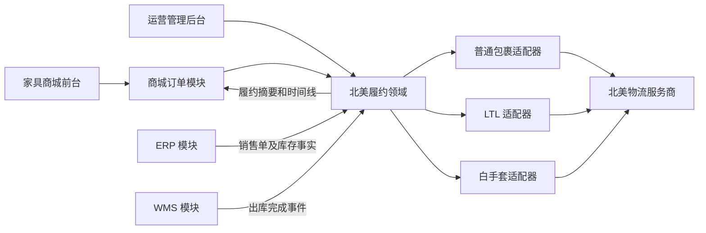

# 北美本地履约与物流跟踪改进工程设计

> English title: North America Local Fulfillment and Tracking Engineering Design

**状态：** 已确认设计，待实施计划

**日期：** 2026-07-15

**目标市场：** 美国、加拿大

**目标业务：** 家具电商北美本地履约，覆盖普通包裹、LTL 大件和白手套配送

**实施策略：** 在现有交易模块内进行可拆分的渐进式领域重构

## 1. 执行摘要

当前系统已经具备订单发货、物流公司和运单号保存、快递100/快递鸟实时查询、Redis 缓存和管理后台物流时间线，但核心模型仍是“一张订单、一个物流公司、一个运单号”。该模型可以处理简单包裹，却无法稳定表达北美家具履约中的分批发货、多包裹、托盘、LTL、PRO/BOL、多运输段、承运商换单、预约入户、组装和签收凭证。

本设计保留现有订单、ERP、WMS 和物流客户端基础，在 `yudao-module-trade-server` 内建立独立的 `fulfillment` 领域。新领域拥有发货单、包裹、运输段、物流事件、配送预约、异常和签收凭证；第三方服务商通过统一适配器接入；商城、ERP 和 WMS 只依赖稳定的内部接口与事件契约。领域边界按未来可拆分为独立物流服务的方式设计，但首期不新增微服务，避免引入不必要的部署和一致性成本。

首期仅处理北美本地履约：

- 美国仓或美国 3PL 到美国地址，即 `US -> US`。
- 加拿大仓或加拿大 3PL 到加拿大地址，即 `CA -> CA`。
- 普通包裹、LTL 和白手套配送。
- 美国英语、加拿大英语和加拿大法语。

首期明确不处理：

- 中国境内物流。
- 中国至美国或加拿大的海运、空运、国际干线和清关。
- 美国与加拿大之间的跨境运输和清关，即 `US <-> CA`。
- 欧洲、法国和其他市场。
- 自动比价、购买面单、物流对账和运费结算；这些能力可在后续阶段基于同一领域扩展。

## 2. 背景和现状审计

### 2.1 现有业务能力

现有代码已经实现以下能力：

- 管理后台选择物流公司并填写运单号：
  `yudao-ui-admin-vue3/src/views/mall/trade/order/form/OrderDeliveryForm.vue`。
- 发货请求保存 `logisticsId`、`logisticsNo`、发货时间并推进订单状态：
  `TradeOrderUpdateServiceImpl.deliveryOrder(...)`。
- 管理端和用户端均提供 `/trade/order/get-express-track-list`。
- `TradeOrderQueryServiceImpl` 根据订单、物流公司编码、运单号和收件人电话调用第三方查询。
- `ExpressClient`、`ExpressClientFactory` 已提供基本服务商抽象。
- 已实现快递100和快递鸟客户端。
- 第三方节点被统一为 `time + content`。
- 查询结果通过 Spring Cache 和 Redis 缓存一小时。
- 管理后台使用时间线展示物流节点。
- ERP 已被定义为实际库存与销售履约主数据系统，商城与 ERP 之间已有产品、库存和履约集成设计。
- WMS 已有出库单、完成出库和库存更新能力。

### 2.2 现有配置限制

现有快递鸟配置默认使用国内实时查询指令 `1002`，本地环境使用 `not_provide`；快递100客户端只发送承运商编码、运单号和收件人电话。即使供应商本身提供国际能力，当前账号产品、承运商代码、数据处理地区和家具大件能力也没有完成北美真实运单验证。

### 2.3 现有模型限制

`TradeOrderDO` 只有一个 `logisticsId` 和一个 `logisticsNo`，导致：

- 不能表达一张订单分批发货。
- 不能表达多个纸箱、家具件或托盘。
- 不能把订单商品映射到具体包裹。
- 不能表达 LTL 的 PRO Number、BOL 和托盘。
- 不能表达干线段与末端配送段。
- 承运商换单时只能覆盖原运单，历史链路丢失。
- 不能表达预约配送、改约、入户、组装和 POD。
- 第三方轨迹不落业务库，无法形成稳定审计、异常队列和运营指标。
- 查询由页面加载触发，没有可靠 webhook 主链路。
- 空轨迹也可能被缓存一小时，刚交运的包裹可能延迟显示。
- 缓存键包含收件人手机号，增加个人信息泄漏面。
- 家具商城用户订单页尚未接入物流轨迹。

### 2.4 当前能力保留清单

以下能力保留并逐步迁移：

- 订单发货入口和权限模型。
- 物流公司基础资料管理。
- `ExpressClient` 的适配器思想。
- 管理端物流时间线交互模式。
- Redis、Spring Cache、定时任务和现有审计基础设施。
- ERP 产品、库存和销售单边界。
- WMS 出库事实。
- 旧订单物流字段和旧查询接口的兼容读取。

## 3. 目标和非目标

### 3.1 业务目标

改造完成后，系统必须支持：

1. 一张订单创建多张发货单。
2. 一个订单商品分批发货，但累计发货数量不能超过购买数量。
3. 一张发货单包含多个包裹、托盘或家具件。
4. 一张发货单包含多个有序运输段。
5. 普通包裹使用 Tracking Number。
6. LTL 使用 Tracking Number、PRO Number 或 BOL Number。
7. 白手套配送支持预约、改约、入户服务和 POD。
8. 美国、加拿大本地承运商通过统一适配器接入。
9. webhook 为主、主动查询为补偿。
10. 第三方原始状态转换成稳定的内部状态。
11. 商城前台展示多包裹、时间线、预约、异常和 POD。
12. 管理后台提供异常队列、重试和人工纠正。
13. 英语、加拿大法语、当地时区和夏令时正确显示。
14. 新旧接口在迁移期并存，旧订单继续可查。

### 3.2 技术目标

- 服务商可替换，不让商城 API 绑定某一家供应商协议。
- 状态更新幂等、可审计、可补偿、不可倒退。
- 物流故障不能改变支付事实或回滚 ERP/WMS 事实。
- 个人信息最小化发送、加密存储、脱敏记录、限期保留。
- 每项核心能力都有自动化测试和可量化上线门槛。

### 3.3 非目标

- 不重写商城订单和支付模块。
- 不允许浏览器直接调用物流服务商。
- 不允许物流服务商直接控制订单支付状态。
- 不在首期购买面单、计算运价或执行物流财务对账。
- 不在首期跟踪中国至北美的国际运输和清关。
- 不把第三方原始状态直接展示为唯一客户状态。
- 不在首期创建独立物流微服务。

## 4. 术语和角色

| 术语 | 定义 |
|---|---|
| Carrier | 实际运输货物的承运商，例如邮政、商业快递、LTL 或白手套公司 |
| Aggregator | 聚合多家承运商查询、面单或 webhook 的物流技术平台 |
| 3PL | 第三方仓储和履约服务商，负责仓储、拣货、包装、出库或配送编排 |
| Shipment | 一次独立发货，关联订单中的部分或全部商品 |
| Package | 一个纸箱、家具件、托盘或其他可被跟踪的物理单元 |
| Shipment Leg | 一段由特定承运商执行的运输，例如区域干线或末端配送 |
| Tracking Number | 普通包裹的跟踪号 |
| PRO Number | 北美 LTL 常用货运识别号 |
| BOL | Bill of Lading，提单或运输合同编号 |
| LTL | Less Than Truckload，货量不足整车的拼车零担运输 |
| White Glove | 预约入户、拆包、摆放、可选组装和包装清理的高服务等级配送 |
| POD | Proof of Delivery，签名、照片、文件或收件人信息等签收凭证 |
| Canonical Event | 系统内部统一的物流事件 |
| Provider Event | 第三方服务商返回的原始事件 |

在角色类比上，北美不存在一家完全等同于京东物流的统一平台。普通包裹承运商类似顺丰、韵达；聚合平台类似菜鸟的技术聚合部分；LTL 类似大件零担网络；白手套类似家具或家电入户送装。系统必须把这些角色组合成统一履约体验。

## 5. 方案比较和架构决策

### 5.1 方案 A：扩展现有快递查询

只增加北美承运商适配器，继续使用订单单运单模型。

优点：开发快、改动小。

缺点：不能支持家具业务核心场景，未来仍需二次迁移。

### 5.2 方案 B：渐进式物流领域重构

在交易模块内新增发货、包裹、运输段、事件、预约和 POD 模型；保留旧字段作为兼容摘要；通过适配器接入第三方。

优点：覆盖完整业务，兼容现有系统，部署风险可控，未来可拆服务。

缺点：需要数据库迁移、状态机和前后端同步改造。

### 5.3 方案 C：独立物流微服务

新建独立服务和数据库，通过消息与 Trade、ERP、WMS 通信。

优点：边界最强、独立扩容。

缺点：首期引入服务治理、消息一致性、部署和运维成本，超出当前必要范围。

### 5.4 决策

选择方案 B。领域包、表名、内部 API 和事件契约不依赖交易模块内部实现，满足未来拆分条件；首期仍与交易模块同服务部署，共用现有租户、权限、事务、Redis、任务和可观测性基础设施。

## 6. 目标架构



### 6.1 模块职责

**Trade**

- 订单、订单商品、价格、支付和售后事实。
- 对用户暴露订单视图，并组合履约摘要。
- 不解析第三方状态，不保存第三方凭据。

**ERP**

- 产品、销售单、实际库存和出入库业务事实。
- 不直接修改客户物流状态和支付事实。

**WMS**

- 仓库拣货、包装和出库事实。
- 完成出库后发布幂等事件。

**Fulfillment**

- 发货单、发货商品、包裹、运输段、轨迹、预约、异常和 POD。
- 服务商注册、查询、webhook、补偿和状态转换。
- 订单履约摘要和客户可见状态。

**Provider Adapter**

- 服务商认证、签名、限流和协议转换。
- 承运商编码、能力、错误和状态映射。
- 不包含订单支付和库存业务逻辑。

### 6.2 包结构

首期建议在 Trade Server 内创建：

```text
cn.iocoder.yudao.module.trade
└─ fulfillment
   ├─ controller
   │  ├─ admin
   │  ├─ app
   │  └─ webhook
   ├─ service
   │  ├─ shipment
   │  ├─ tracking
   │  ├─ appointment
   │  ├─ pod
   │  └─ provider
   ├─ dal
   │  ├─ dataobject
   │  ├─ mysql
   │  └─ redis
   ├─ framework
   │  └─ provider
   ├─ convert
   ├─ enums
   ├─ event
   └─ job
```

## 7. 领域模型

```text
TradeOrder
  └─ Shipment (1:N)
       ├─ ShipmentItem (1:N)
       ├─ Package (1:N)
       ├─ ShipmentLeg (1:N)
       │    └─ TrackingEvent (1:N)
       ├─ DeliveryAppointment (0:N)
       └─ ProofOfDelivery (0:N)
```

### 7.1 发货单 `trade_shipment`

| 字段 | 类型 | 规则 |
|---|---|---|
| id | BIGINT | 主键 |
| tenant_id | BIGINT | 必填，租户隔离 |
| order_id | BIGINT | 必填，关联商城订单 |
| shipment_no | VARCHAR(32) | 必填，租户内唯一 |
| shipment_type | VARCHAR(20) | `PARCEL`、`LTL`、`WHITE_GLOVE` |
| status | VARCHAR(32) | 标准发货单状态 |
| origin_country | CHAR(2) | `US` 或 `CA` |
| destination_country | CHAR(2) | 必须等于 `origin_country` |
| origin_timezone | VARCHAR(64) | IANA 时区 |
| destination_timezone | VARCHAR(64) | IANA 时区 |
| warehouse_id | BIGINT | 北美仓或 3PL 仓标识 |
| provider_id | BIGINT | 当前主服务商，可为空 |
| estimated_delivery_at | DATETIME | 统一存 UTC |
| delivered_at | DATETIME | 统一存 UTC |
| version | INT | 乐观锁 |
| creator/updater/create_time/update_time/deleted | 标准字段 | 沿用项目规范 |

唯一约束：

```text
(tenant_id, shipment_no, deleted)
```

检查规则：

- 首期仅允许 `US -> US`、`CA -> CA`。
- `WHITE_GLOVE` 必须至少有一个预约能力服务商或人工预约流程。
- 发货单进入 `HANDED_TO_CARRIER` 后，发货商品数量不能无审计地修改。

### 7.2 发货商品 `trade_shipment_item`

| 字段 | 类型 | 规则 |
|---|---|---|
| id | BIGINT | 主键 |
| tenant_id | BIGINT | 必填 |
| shipment_id | BIGINT | 必填 |
| order_item_id | BIGINT | 必填 |
| sku_id | BIGINT | 必填 |
| quantity | DECIMAL(24,6) | 大于零 |

约束：

```text
(tenant_id, shipment_id, order_item_id, deleted)
```

服务层在订单行上加锁或使用版本检查，确保同一 `order_item_id` 所有有效发货行数量之和不超过订单购买数量。

### 7.3 包裹 `trade_shipment_package`

| 字段 | 类型 | 规则 |
|---|---|---|
| id | BIGINT | 主键 |
| tenant_id | BIGINT | 必填 |
| shipment_id | BIGINT | 必填 |
| package_no | VARCHAR(32) | 发货单内唯一 |
| package_type | VARCHAR(20) | `PARCEL`、`CARTON`、`PALLET`、`FURNITURE_ITEM` |
| carrier_id | BIGINT | 可在创建草稿时为空，交运前必填 |
| tracking_number | VARCHAR(64) | 普通包裹主跟踪号 |
| weight | DECIMAL(18,6) | 非负 |
| weight_unit | VARCHAR(4) | `LB` 或 `KG` |
| length/width/height | DECIMAL(18,6) | 非负 |
| dimension_unit | VARCHAR(4) | `IN` 或 `CM` |
| status | VARCHAR(32) | 包裹标准状态 |
| version | INT | 乐观锁 |

唯一约束：

```text
(tenant_id, shipment_id, package_no, deleted)
(tenant_id, carrier_id, tracking_number, deleted)
```

第二个约束只对非空活动运单生效；同一运单不得绑定多个活动发货单。

### 7.4 运输段 `trade_shipment_leg`

| 字段 | 类型 | 规则 |
|---|---|---|
| id | BIGINT | 主键 |
| tenant_id | BIGINT | 必填 |
| shipment_id | BIGINT | 必填 |
| package_id | BIGINT | 可为空，表示整票运输段 |
| sequence_no | INT | 从 1 开始，发货单内有序 |
| leg_type | VARCHAR(20) | `FIRST_MILE`、`LINEHAUL`、`LAST_MILE` |
| carrier_id | BIGINT | 必填 |
| provider_id | BIGINT | 必填 |
| service_level | VARCHAR(64) | 服务商标准或内部服务等级 |
| tracking_number | VARCHAR(64) | 可为空 |
| pro_number | VARCHAR(64) | LTL 可用 |
| bol_number | VARCHAR(64) | LTL 可用 |
| origin_location | VARCHAR(256) | 脱敏业务地点 |
| destination_location | VARCHAR(256) | 脱敏业务地点 |
| status | VARCHAR(32) | 运输段标准状态 |
| started_at/completed_at | DATETIME | UTC |
| version | INT | 乐观锁 |

唯一约束：

```text
(tenant_id, shipment_id, sequence_no, deleted)
```

承运商换单或进入末端承运商时新增下一运输段，不覆盖旧运输段。

### 7.5 物流事件 `trade_tracking_event`

| 字段 | 类型 | 规则 |
|---|---|---|
| id | BIGINT | 主键 |
| tenant_id | BIGINT | 必填 |
| shipment_id | BIGINT | 必填 |
| package_id | BIGINT | 可为空 |
| shipment_leg_id | BIGINT | 可为空 |
| provider_id | BIGINT | 必填 |
| external_event_id | VARCHAR(128) | 服务商事件 ID，可为空 |
| event_hash | CHAR(64) | 无事件 ID 时的稳定摘要 |
| standard_status | VARCHAR(32) | 内部标准状态 |
| provider_status | VARCHAR(128) | 服务商原始状态码 |
| description | VARCHAR(1024) | 客户可读或运营可读描述 |
| location | VARCHAR(256) | 事件地点，不保存完整收货地址 |
| occurred_at | DATETIME | 事件发生 UTC 时间 |
| occurred_timezone | VARCHAR(64) | 原始或推断 IANA 时区 |
| received_at | DATETIME | 系统收到时间 |
| raw_payload_ref | VARCHAR(256) | 受控原始报文引用 |
| source | VARCHAR(20) | `WEBHOOK`、`POLLING`、`MANUAL`、`MIGRATION` |

去重规则：

- 有 `external_event_id`：唯一 `(tenant_id, provider_id, external_event_id)`。
- 无 `external_event_id`：唯一 `(tenant_id, provider_id, event_hash)`。
- `event_hash` 基于承运商、跟踪号、原始状态、发生时间、地点和描述的规范化值生成。

### 7.6 配送预约 `trade_delivery_appointment`

| 字段 | 类型 | 规则 |
|---|---|---|
| id | BIGINT | 主键 |
| tenant_id | BIGINT | 必填 |
| shipment_id | BIGINT | 必填 |
| appointment_no | VARCHAR(64) | 租户内唯一 |
| status | VARCHAR(32) | 预约状态 |
| time_window_start/end | DATETIME | UTC |
| timezone | VARCHAR(64) | 必填 IANA 时区 |
| contact_channel | VARCHAR(16) | `PHONE`、`SMS`、`EMAIL`、`PORTAL` |
| provider_confirmation_no | VARCHAR(128) | 可为空 |
| reschedule_count | INT | 非负 |
| contact_ref | VARCHAR(128) | 受控个人信息引用，不保存完整电话 |
| version | INT | 乐观锁 |

一个发货单允许保留多次预约历史，但同一时间最多一个活动预约。

### 7.7 签收凭证 `trade_proof_of_delivery`

| 字段 | 类型 | 规则 |
|---|---|---|
| id | BIGINT | 主键 |
| tenant_id | BIGINT | 必填 |
| shipment_id | BIGINT | 必填 |
| pod_type | VARCHAR(20) | `SIGNATURE`、`PHOTO`、`DOCUMENT`、`RECEIVER_NAME` |
| storage_file_id | BIGINT | 受控文件存储 ID |
| receiver_name_masked | VARCHAR(128) | 可选脱敏名称 |
| received_at | DATETIME | UTC |
| verified_status | VARCHAR(20) | `UNVERIFIED`、`VERIFIED`、`REJECTED` |
| retention_until | DATETIME | 到期后进入删除流程 |
| source | VARCHAR(20) | `PROVIDER` 或 `MANUAL` |

数据库不保存文件二进制和第三方永久公开 URL。

### 7.8 承运商和服务商

新增或扩展：

```text
trade_carrier
trade_logistics_provider
trade_logistics_provider_account
trade_logistics_webhook_log
trade_logistics_sync_job
trade_fulfillment_outbox_event
```

`trade_carrier` 表达实际承运商；`trade_logistics_provider` 表达聚合平台或直接 API 服务；二者不能混为同一概念。一个服务商可以映射多家承运商，一家承运商也可以通过多个服务商访问。

服务商账号表只保存账号标识、能力、启用状态、限流策略和 Secret Manager 引用，不保存明文密钥。

## 8. 状态机

### 8.1 发货单状态

```text
DRAFT
READY_TO_SHIP
HANDED_TO_CARRIER
IN_TRANSIT
AT_LOCAL_TERMINAL
APPOINTMENT_REQUIRED
APPOINTMENT_CONFIRMED
OUT_FOR_DELIVERY
DELIVERED
DELIVERY_EXCEPTION
RETURNING
RETURNED
CANCELED
```

### 8.2 订单履约摘要

```text
NOT_SHIPPED
PARTIALLY_SHIPPED
SHIPPED
PARTIALLY_DELIVERED
DELIVERED
DELIVERY_EXCEPTION
RETURNING
RETURNED
```

### 8.3 状态转换规则

| 当前状态 | 允许的主要下一状态 |
|---|---|
| DRAFT | READY_TO_SHIP、CANCELED |
| READY_TO_SHIP | HANDED_TO_CARRIER、CANCELED |
| HANDED_TO_CARRIER | IN_TRANSIT、DELIVERY_EXCEPTION、CANCELED |
| IN_TRANSIT | AT_LOCAL_TERMINAL、APPOINTMENT_REQUIRED、OUT_FOR_DELIVERY、DELIVERY_EXCEPTION、RETURNING |
| AT_LOCAL_TERMINAL | APPOINTMENT_REQUIRED、APPOINTMENT_CONFIRMED、OUT_FOR_DELIVERY、DELIVERY_EXCEPTION、RETURNING |
| APPOINTMENT_REQUIRED | APPOINTMENT_CONFIRMED、DELIVERY_EXCEPTION、RETURNING |
| APPOINTMENT_CONFIRMED | OUT_FOR_DELIVERY、APPOINTMENT_REQUIRED、DELIVERY_EXCEPTION、RETURNING |
| OUT_FOR_DELIVERY | DELIVERED、APPOINTMENT_REQUIRED、DELIVERY_EXCEPTION、RETURNING |
| DELIVERY_EXCEPTION | IN_TRANSIT、AT_LOCAL_TERMINAL、APPOINTMENT_REQUIRED、APPOINTMENT_CONFIRMED、OUT_FOR_DELIVERY、DELIVERED、RETURNING |
| RETURNING | RETURNED、DELIVERY_EXCEPTION |
| DELIVERED | 终态；只有受控售后流程可以创建独立退货链路 |
| RETURNED | 终态 |
| CANCELED | 终态 |

规则：

- 迟到事件写入时间线但不能回退当前状态。
- `DELIVERY_EXCEPTION` 为可恢复状态。
- `DELIVERED` 必须来自可信承运商事件、POD 或授权人工确认。
- 部分包裹送达不能使整张发货单完成。
- 所有必须交付的包裹完成后，发货单才完成。
- 所有有效发货单完成后，订单摘要才为 `DELIVERED`。
- 人工修正生成独立审计事件，不覆盖历史事件。
- 物流状态不修改支付状态。

### 8.4 第三方状态映射

服务商适配器先输出 `ProviderTrackingEvent`，领域层再映射为标准状态。映射表必须版本化，并记录：

```text
provider_code
carrier_code
provider_status
standard_status
mapping_version
effective_at
```

未知状态映射为 `IN_TRANSIT` 或保持当前状态，并产生低优先级映射告警；不得因未知第三方状态把订单标记为送达或退回。

## 9. 北美服务商策略

### 9.1 接入原则

系统不在设计阶段把业务绑定到单一供应商。Phase 0 使用真实运单和商业账号完成技术与合同 PoC，并在进入普通包裹生产阶段前确定：

- 一个主普通包裹聚合或直接查询通道。
- 一个可切换的普通包裹备用通道，至少完成接口验证。
- 实际业务使用的 LTL 通道。
- 实际业务使用的白手套通道。

### 9.2 首批承运商覆盖目标

普通包裹的承运商代码表至少覆盖业务实际使用的以下类别：

- 美国邮政和商业包裹承运商。
- 加拿大邮政和商业包裹承运商。
- 美国、加拿大跨区域配送中实际使用的本地承运商。

候选聚合平台的官方承运商文档必须作为 PoC 输入。例如 Shippo 官方跟踪列表包含 Canada Post、La Poste、UPS、FedEx、Purolator 等，但其官方文档也说明某些承运商要求绑定账号，部分承运商只允许跟踪通过平台创建的运输。因此“列表上存在”不能替代真实账号和真实运单验证：

- [Shippo Tracking Carriers](https://docs.goshippo.com/docs/Tracking/TrackingCarriers)
- [Shippo Tracking Restrictions](https://docs.goshippo.com/docs/Tracking/Tracking)
- [EasyPost Canada Post BYOCA Guide](https://docs.easypost.com/carriers/canada-post-byoa-guide)

### 9.3 PoC 评分表

每个候选服务商按 100 分评估：

| 维度 | 分值 |
|---|---:|
| 美国、加拿大实际承运商覆盖 | 20 |
| 普通包裹真实运单成功率 | 10 |
| LTL 或白手套能力 | 10 |
| webhook 完整性和延迟 | 10 |
| POD 与预约能力 | 10 |
| 沙箱和技术文档 | 5 |
| 账号限制与可移植性 | 10 |
| SLA、限流和故障透明度 | 5 |
| 数据处理地区和隐私合同 | 10 |
| 单票成本和最低消费 | 5 |
| 技术支持和退出能力 | 5 |

普通包裹主通道必须达到 75 分，且“实际承运商覆盖”“真实运单成功率”“隐私合同”三项均不得为零。LTL 和白手套可选择不同供应商，不要求一个平台承担全部能力。

## 10. 服务商适配器

### 10.1 统一接口

```java
public interface LogisticsProviderClient {

    ProviderCapabilities getCapabilities();

    TrackingRegistrationResult registerTracking(
            TrackingRegistrationCommand command);

    TrackingSnapshot queryTracking(
            TrackingQuery command);

    AppointmentResult createAppointment(
            AppointmentCommand command);

    AppointmentResult rescheduleAppointment(
            RescheduleAppointmentCommand command);

    ProofOfDeliveryResult queryProofOfDelivery(
            ProofOfDeliveryQuery query);

    WebhookVerificationResult verifyWebhook(
            WebhookRequest request);

    List<ProviderTrackingEvent> parseWebhook(
            WebhookRequest request);
}
```

### 10.2 能力声明

```text
TRACKING_QUERY
TRACKING_WEBHOOK
APPOINTMENT
POD
LABEL
CANCELLATION
LTL
WHITE_GLOVE
```

业务层先检查能力。不支持预约的服务商不能创建自动预约任务；系统可以转入明确的人工预约流程，但不得伪装成自动成功。

### 10.3 错误分类

| 错误类别 | 处理 |
|---|---|
| PROVIDER_TEMPORARY | 超时、限流、5xx；自动退避重试 |
| PROVIDER_PERMANENT | 账号无权限、无效承运商；停止自动重试并告警 |
| TRACKING_NOT_FOUND | 运单未上网；延迟查询 |
| DATA_CONFLICT | 运单关联冲突；进入人工队列 |
| DELIVERY_EXCEPTION | 地址、拒收、破损等履约异常 |
| SECURITY_REJECTED | webhook 签名失败；拒绝业务处理 |
| UNSUPPORTED_CAPABILITY | 创建业务前拒绝或进入明确人工流程 |

## 11. 核心业务流程

### 11.1 WMS 出库到发货单

1. WMS 完成北美本地仓出库。
2. WMS 发布 `WMS_OUTBOUND_COMPLETED`，携带稳定幂等键。
3. Fulfillment 校验租户、订单、商品和仓库国家。
4. 创建草稿发货单和发货商品。
5. 仓库、3PL 或运营补充包裹、承运商和运单。
6. `dispatch` 校验完整性并把状态推进到 `HANDED_TO_CARRIER`。
7. 异步注册第三方跟踪。
8. 注册失败不回滚 WMS 出库事实，写入同步任务并重试。

### 11.2 Webhook 处理

1. 通过 `/webhooks/logistics/{providerCode}` 定位服务商。
2. 读取原始请求字节，验证签名、时间戳和重放窗口。
3. 执行请求体大小和速率限制。
4. 保存加密原始报文或安全引用。
5. 生成 webhook 幂等键，快速返回服务商要求的成功响应。
6. 异步解析并转换为标准事件。
7. 按外部事件 ID 或事件摘要去重。
8. 写入时间线。
9. 使用状态机和乐观锁推进包裹、运输段、发货单和订单摘要。
10. 发布 outbox 事件，触发通知、告警和指标。

### 11.3 主动查询补偿

轮询用于：

- 服务商不支持 webhook。
- webhook 长时间没有更新。
- webhook 处理失败后的恢复。
- 关键状态加速查询。
- 运营人工重试。

刷新频率按状态配置，不使用统一一小时缓存：

| 状态 | 建议最短刷新间隔 |
|---|---:|
| HANDED_TO_CARRIER 且未上网 | 30 分钟 |
| IN_TRANSIT | 2 小时 |
| AT_LOCAL_TERMINAL | 30 分钟 |
| APPOINTMENT_REQUIRED | 30 分钟 |
| APPOINTMENT_CONFIRMED | 1 小时 |
| OUT_FOR_DELIVERY | 15 分钟 |
| DELIVERY_EXCEPTION | 30 分钟 |
| DELIVERED/RETURNED/CANCELED | 停止普通轮询 |

实际调用必须同时服从服务商限流、套餐和成本策略。

### 11.4 白手套预约

1. 标准事件进入 `APPOINTMENT_REQUIRED`。
2. 系统读取服务商能力和可选时间窗口。
3. 用户或运营选择窗口。
4. 服务商确认后写入 `APPOINTMENT_CONFIRMED`。
5. 改约创建新预约版本并保留历史。
6. 超过允许次数或服务商不支持自动改约时进入人工队列。
7. 预约失败不修改支付事实或删除发货单。

### 11.5 签收凭证

1. `DELIVERED` 事件触发 POD 查询或等待 POD webhook。
2. 文件下载到受控对象存储，记录摘要和来源。
3. 执行恶意文件检查和内容类型校验。
4. POD 通过短期签名 URL 提供给订单本人或授权角色。
5. 到达保留期限后删除文件并保留最小审计元数据。

### 11.6 逆向物流

退货创建独立的反向 Shipment 和 TrackingEvent 链路，不修改原发货链路。原订单售后模块拥有退款和退货审批事实；Fulfillment 只跟踪退回运输；ERP/WMS 只在实际退货入库完成后恢复库存。

## 12. API 契约

### 12.1 管理端 API

```text
POST   /admin-api/trade/fulfillment/shipments
PUT    /admin-api/trade/fulfillment/shipments/{id}
POST   /admin-api/trade/fulfillment/shipments/{id}/dispatch
POST   /admin-api/trade/fulfillment/shipments/{id}/packages
POST   /admin-api/trade/fulfillment/shipments/{id}/legs
POST   /admin-api/trade/fulfillment/shipments/{id}/retry-tracking
POST   /admin-api/trade/fulfillment/shipments/{id}/manual-event
GET    /admin-api/trade/fulfillment/shipments/{id}
GET    /admin-api/trade/fulfillment/shipments/{id}/timeline
GET    /admin-api/trade/fulfillment/shipments/page
GET    /admin-api/trade/fulfillment/exceptions/page
POST   /admin-api/trade/fulfillment/appointments
PUT    /admin-api/trade/fulfillment/appointments/{id}/reschedule
GET    /admin-api/trade/fulfillment/pod/{shipmentId}
```

所有写接口要求：

- 登录、权限和租户校验。
- `Idempotency-Key`。
- 请求版本或 `If-Match` 乐观锁。
- 操作原因和审计记录。
- 服务端重新校验订单、商品、国家和状态。

### 12.2 用户端 API

```text
GET /app-api/trade/order/{orderId}/fulfillment-summary
GET /app-api/trade/order/{orderId}/shipments
GET /app-api/trade/shipment/{shipmentId}/timeline
GET /app-api/trade/shipment/{shipmentId}/appointment
PUT /app-api/trade/shipment/{shipmentId}/appointment
GET /app-api/trade/shipment/{shipmentId}/proof-of-delivery
```

响应示例：

```json
{
  "orderId": 1024,
  "status": "PARTIALLY_DELIVERED",
  "shipments": [
    {
      "shipmentId": 70001,
      "shipmentNo": "SHP-20260715-0001",
      "shipmentType": "WHITE_GLOVE",
      "status": "APPOINTMENT_CONFIRMED",
      "estimatedDeliveryAt": "2026-07-18T14:00:00-04:00",
      "destinationTimezone": "America/Toronto",
      "packages": [
        {
          "packageNo": "PKG-1",
          "carrierName": "Localized carrier name",
          "trackingNumberMasked": "***7890",
          "status": "AT_LOCAL_TERMINAL"
        }
      ]
    }
  ]
}
```

用户端服务必须通过 `orderId + loginUserId` 验证归属，不能只按 `shipmentId` 查询。

### 12.3 错误码

建议新增受控错误码：

```text
FULFILLMENT_SHIPMENT_NOT_FOUND
FULFILLMENT_ORDER_NOT_FOUND
FULFILLMENT_ORDER_ITEM_QUANTITY_EXCEEDED
FULFILLMENT_COUNTRY_NOT_SUPPORTED
FULFILLMENT_CROSS_BORDER_NOT_SUPPORTED
FULFILLMENT_INVALID_STATUS_TRANSITION
FULFILLMENT_DUPLICATE_TRACKING_NUMBER
FULFILLMENT_PROVIDER_NOT_AVAILABLE
FULFILLMENT_PROVIDER_CAPABILITY_UNSUPPORTED
FULFILLMENT_APPOINTMENT_CONFLICT
FULFILLMENT_POD_NOT_AVAILABLE
FULFILLMENT_WEBHOOK_SIGNATURE_INVALID
FULFILLMENT_VERSION_CONFLICT
```

错误响应不得回显第三方原始响应、完整运单个人信息、密钥或内部堆栈。

## 13. 内部事件和一致性

### 13.1 输入事件

```text
ERP_SALE_ORDER_READY
WMS_OUTBOUND_COMPLETED
WMS_OUTBOUND_CANCELED
SHIPMENT_DISPATCH_REQUESTED
```

`WMS_OUTBOUND_COMPLETED` 最小载荷：

```json
{
  "eventId": "uuid",
  "tenantId": 121,
  "warehouseId": 1001,
  "outboundOrderId": 90001,
  "mallOrderId": 1024,
  "completedAt": "2026-07-15T03:00:00Z",
  "items": [
    {
      "orderItemId": 5001,
      "skuId": 2001,
      "quantity": 1
    }
  ],
  "idempotencyKey": "121:90001:WMS_OUTBOUND_COMPLETED"
}
```

### 13.2 输出事件

```text
SHIPMENT_CREATED
PACKAGE_DISPATCHED
TRACKING_UPDATED
DELIVERY_EXCEPTION
APPOINTMENT_REQUIRED
APPOINTMENT_CONFIRMED
OUT_FOR_DELIVERY
DELIVERED
POD_RECEIVED
RETURN_STARTED
RETURNED
```

### 13.3 Outbox

领域状态和 outbox 事件在同一数据库事务提交。异步发布器使用事件 ID 幂等消费，失败按退避策略重试。下游通知或分析失败不能回滚已提交的物流状态。

幂等键：

```text
WMS：tenantId + outboundOrderId + eventType
第三方事件：providerId + externalEventId
无事件 ID：providerId + eventHash
人工请求：tenantId + Idempotency-Key
```

## 14. ERP、WMS 和商城边界

### 14.1 ERP

- ERP 是产品、实际库存、销售单和入出库业务事实主方。
- ERP 审核或销售单状态不能直接标记客户已发货。
- ERP 不改变商城支付状态。
- 退货库存只在实际入库完成后恢复一次。

### 14.2 WMS

- WMS 完成出库后产生履约创建依据。
- 出库完成不等于承运商已接货。
- WMS 重复事件必须命中同一幂等记录。
- WMS 出库取消在发货单交运前可取消发货单；交运后进入人工异常流程。

### 14.3 Trade

- Trade 拥有订单支付和售后事实。
- Fulfillment 只回写履约摘要或通过查询组合，不直接更改支付状态。
- 客户确认收货可以参考 `DELIVERED`，但仍由 Trade 的收货规则决定最终订单状态。
- 物流退回不自动退款，必须进入售后流程。

## 15. 管理后台设计

新增菜单和页面：

1. **北美发货单**：查询、创建、拆单、包裹和运输段。
2. **物流时间线**：标准状态和受控原始信息并排查看。
3. **配送预约**：待预约、已确认、改约、失败和人工处理。
4. **签收凭证**：受权限控制的 POD 查看和审核。
5. **物流异常中心**：地址、破损、拒收、无轨迹、账号和映射异常。
6. **同步任务**：失败原因、次数、下次执行时间和人工重试。
7. **服务商与账号**：能力、国家、承运商映射、限流、Secret 引用和开关。
8. **Webhook 审计**：签名结果、事件数量、延迟、幂等结果和 trace ID。

权限建议：

```text
trade:fulfillment:shipment:query
trade:fulfillment:shipment:create
trade:fulfillment:shipment:update
trade:fulfillment:shipment:dispatch
trade:fulfillment:tracking:retry
trade:fulfillment:tracking:manual
trade:fulfillment:appointment:manage
trade:fulfillment:pod:query
trade:fulfillment:provider:manage
trade:fulfillment:webhook:audit
```

人工状态修正、POD 查看和服务商账号管理为高权限操作，必须单独授权。

## 16. 商城用户体验

订单页展示：

- 订单履约摘要。
- 每张发货单和对应商品。
- 每个包裹或家具件状态。
- 标准物流时间线。
- 预计送达时间。
- 预约入口和已确认窗口。
- 配送异常和联系客服指引。
- POD 可用状态及受控查看入口。
- 承运商官网备用链接。

国际化：

```text
en-US
en-CA
fr-CA
```

客户可见文案由标准状态生成；第三方原始描述作为辅助信息，按服务商数据质量决定是否展示或翻译。数据库统一存 UTC，API 返回 ISO 8601 带偏移时间，前端按 `destinationTimezone` 显示。测试必须覆盖北美夏令时切换。

## 17. 隐私、安全和合规控制

本节是工程控制要求，不替代美国、加拿大律师对实际主体、州、省、合同和业务模式的法律意见。

### 17.1 数据分类

| 数据 | 分类 | 控制 |
|---|---|---|
| 承运商、运单号、标准状态 | 内部业务数据 | 角色权限、审计 |
| 姓名、电话、地址、预约窗口 | 个人信息 | 加密、最小化、脱敏、限期保留 |
| 签名、入户照片、收件人姓名 | 高敏感履约数据 | 独立权限、短期签名 URL、短期保留 |
| 服务商密钥和 webhook secret | 凭据 | Secret Manager、轮换、禁止日志 |
| 第三方原始报文 | 受控审计数据 | 加密、脱敏、严格保留期 |

### 17.2 加拿大要求转化

加拿大隐私专员办公室说明，PIPEDA 对商业活动中跨省或跨国流动的个人信息适用；将信息交给第三方处理并不免除企业责任，企业应通过合同或其他手段提供相当程度保护，并透明说明可能的境外处理：

- [PIPEDA requirements in brief](https://www.priv.gc.ca/en/privacy-topics/privacy-laws-in-canada/the-personal-information-protection-and-electronic-documents-act-pipeda/pipeda_brief?wbdisable=true)
- [Guidelines for processing personal data across borders](https://www.priv.gc.ca/en/privacy-topics/airports-and-borders/gl_dab_090127/?wbdisable=true)

工程要求：

- 服务商接入记录数据处理地区、子处理商、用途、保留和删除能力。
- 合同明确只为履约目的处理数据、保密、安全、事件通知和删除义务。
- 隐私政策透明说明物流服务商和可能的数据处理司法辖区。
- 加拿大省级法律由发布前合规清单确认；系统保留访问、更正、导出和删除能力。

### 17.3 美国要求转化

美国按适用州和业务门槛评估。以加州为例，CPPA 官方资料说明 CCPA/CPRA 对达到门槛的企业及其服务提供商、承包商设定义务，服务商合同和用途限制是工程与采购共同的控制点：

- [CPPA Frequently Asked Questions](https://cppa.ca.gov/faq)
- [California Consumer Privacy Act Regulations](https://cppa.ca.gov/regulations/consumer_privacy_act.html)

工程要求：

- 服务商只能按履约合同目的处理数据。
- 数据主体请求可以定位到订单、发货单、预约、POD 和第三方处理记录。
- 禁止将物流数据用于未经批准的广告画像或出售、共享。
- 发布到新州前运行法规适用性清单，不把加州规则误认为美国全国统一规则。

### 17.4 技术控制

- Redis 键不含明文电话、地址、姓名或签名。
- 缓存使用内部 ID 或租户隔离 HMAC 摘要。
- 仅在承运商明确要求时发送电话，优先发送最少必要部分。
- 服务商请求与响应日志只记录内部 ID、受控错误码、耗时和 trace ID。
- POD 文件使用受控对象存储、恶意文件扫描、内容类型校验和短期签名 URL。
- webhook 使用原始字节验签、时间戳、重放窗口、恒定时间比较、大小限制和限流。
- Secret Manager 引用替代明文密钥；支持当前和上一版本的安全轮换窗口。
- 用户读取任何 shipment、appointment 或 POD 前必须重新验证订单归属。
- 管理端 POD、人工修正和账号操作全部写安全审计。

## 18. 可靠性和故障处理

### 18.1 重试策略

默认自动重试：

```text
第 1 次：1 分钟
第 2 次：5 分钟
第 3 次：15 分钟
第 4 次：1 小时
第 5 次：6 小时
```

达到上限进入人工队列。永久错误不执行无意义重试；服务商 `Retry-After` 大于默认值时遵守服务商要求。

### 18.2 故障隔离

- 每个服务商和账号独立限流。
- 独立连接、读取和总请求超时。
- 服务商级熔断器和停止开关。
- 僵死 `PROCESSING` 任务恢复。
- 死信记录和人工重放。
- webhook 接收与业务消费解耦。
- 服务商不可用时返回最后已知轨迹和受控延迟提示。
- 物流故障不阻塞订单详情、支付、ERP 或 WMS 主流程。

### 18.3 乱序处理

状态更新比较：

```text
occurred_at
+ standard_status_priority
+ database_version
```

迟到事件可以补入时间线。`DELIVERED` 不被普通在途事件覆盖；同时间冲突使用版本化状态优先级；人工修正不删除第三方历史。

## 19. 可观测性和运营指标

核心指标：

```text
tracking_registration_success_rate
webhook_verify_failure_rate
webhook_processing_lag_seconds
tracking_event_duplicate_rate
shipment_without_update_count
provider_request_error_rate
provider_rate_limit_count
delivery_exception_rate
on_time_delivery_rate
appointment_completion_rate
pod_completion_rate
manual_correction_count
tracking_cost_per_shipment
```

告警基线：

- webhook 验签失败率连续 10 分钟异常升高：安全告警。
- webhook 消费 P95 延迟超过 5 分钟：高优先级告警。
- `OUT_FOR_DELIVERY` 超过 24 小时无后续事件：运营告警。
- 新交运包裹超过 24 小时无首条轨迹：运营告警。
- 服务商 5xx 或超时率 15 分钟超过 10%：熔断评估。
- 同一运单冲突绑定：立即进入人工队列。
- POD 预期可用但 48 小时未获取：运营告警。

阈值上线后根据真实基线调整，但降低告警敏感度必须留下审批记录。

## 20. 数据迁移和兼容

### 20.1 兼容策略

迁移期保留：

```text
trade_order.logistics_id
trade_order.logistics_no
GET /trade/order/get-express-track-list
```

新模型定义旧字段为“首个活动包裹的兼容摘要”。

新写入流程：

1. 写入 Shipment、Package 和 ShipmentLeg。
2. 对订单首个活动运单同步旧字段。
3. 新接口读取完整新模型。
4. 旧接口优先读取新模型摘要；无新模型时回退旧字段和旧客户端。

### 20.2 历史数据迁移

- 已完成或已取消历史订单不主动调用第三方补轨迹。
- 有物流字段且仍在活动状态的订单按受控批次生成一个默认 Shipment、Package 和 Leg。
- 迁移事件 `source=MIGRATION`，不伪造成第三方 webhook。
- 迁移使用订单 ID 作为稳定幂等键，可重复执行。
- 无效物流公司或空运单号进入迁移审计报告，不创建虚假活动运单。

### 20.3 数据校验

迁移前后比较：

- 有物流订单数量。
- 活动运单数量。
- 物流公司和运单号一致率。
- 无法迁移和重复冲突数量。
- 新旧订单详情响应一致性。

## 21. 测试策略

### 21.1 单元测试

- 状态机合法和非法转换。
- 异常恢复和终态保护。
- 第三方状态映射和未知状态。
- 事件去重和稳定摘要。
- 乱序事件。
- 发货数量上限。
- 多包裹和多发货单汇总。
- 预约时区、改约和夏令时。
- POD 权限和保留期。
- 日志脱敏和 HMAC 缓存键。

### 21.2 数据库测试

- 租户隔离。
- 唯一约束和乐观锁。
- 一单多发货、一发货单多包裹。
- 同一运单冲突。
- 重复 webhook 不产生重复事件。
- outbox 与领域状态同事务。
- 迁移脚本可重复执行。

### 21.3 适配器契约测试

每个服务商实现通过同一套测试：

- 认证成功和失败。
- 查询成功、无轨迹、无效运单。
- 限流、超时、5xx 和永久错误。
- webhook 签名、重放、重复、乱序。
- 能力声明与实际行为一致。
- POD、预约、LTL 等可选能力。
- 原始报文不泄漏到日志。

### 21.4 集成和端到端场景

- 美国普通包裹。
- 加拿大普通包裹。
- 美国多包裹订单。
- 加拿大 LTL。
- 美国白手套预约配送。
- 商品分批发货。
- 部分送达。
- 地址异常、破损、拒收和退回。
- 承运商换单。
- webhook 丢失后轮询恢复。
- 服务商完全不可用。
- 英语、加拿大法语。
- 北美主要时区和夏令时。
- 用户越权访问其他订单或 POD。
- 日志、缓存、异常响应敏感信息扫描。

## 22. 分阶段实施

### Phase 0：真实服务商 PoC

使用真实或沙箱运单验证美国普通包裹、加拿大普通包裹、一个 LTL 和一个白手套场景。输出评分、账号限制、数据处理、成本和供应商选择记录。

退出条件：普通包裹主通道达到评分门槛；LTL 和白手套至少各有一个真实业务通道或正式人工流程；隐私与合同审查通过。

### Phase 1：领域基础

交付数据表、状态机、订单摘要、管理端创建和拆单、旧字段兼容、租户隔离、审计、幂等和模拟适配器。客户页面保持关闭。

### Phase 2：美国和加拿大普通包裹

交付主服务商适配器、webhook、轮询补偿、承运商映射、管理端轨迹和重试。先对内部运营开放。

### Phase 3：用户端履约体验

交付多包裹、时间线、预计送达、英语/法语、异常提示和通知。

### Phase 4：LTL

交付 PRO/BOL、托盘、多运输段、本地站点、换单和大件异常。

### Phase 5：白手套

交付预约、改约、服务等级、配送中状态、签名、照片和文档 POD。

### Phase 6：运营治理

交付异常中心、SLA、成本、服务商健康、批量恢复、数据请求和密钥轮换。

### Phase 7：旧能力退役

在新系统覆盖全部活动承运商、旧读流量归零、两个完整运营周期稳定和回滚演练完成后，才删除旧客户端依赖和旧字段写入。

## 23. 灰度、发布和回滚

### 23.1 灰度顺序

```text
开发环境模拟适配器
→ 测试环境服务商沙箱
→ 生产影子查询
→ 内部员工订单
→ 单一加拿大仓
→ 单一美国仓
→ 单一普通包裹承运商
→ 全部普通包裹
→ LTL
→ 白手套
```

影子查询期间旧接口继续对用户返回；新系统不控制客户状态，只比较运单识别率、节点数量、最新状态和延迟。

### 23.2 功能开关

```text
fulfillment.enabled
fulfillment.read-from-new-model
fulfillment.write-new-model
fulfillment.webhook-enabled
fulfillment.polling-enabled
fulfillment.customer-ui-enabled
fulfillment.provider.<code>.enabled
fulfillment.ltl-enabled
fulfillment.white-glove-enabled
```

开关支持租户、仓库、国家和服务商维度。

### 23.3 回滚

1. 关闭客户新物流页面。
2. 切回旧接口读取。
3. 停止有问题的服务商适配器。
4. 保留 webhook 原始消息但暂停业务消费。
5. 停止定时查询。
6. 保留新表和已写数据，不执行破坏性反向迁移。
7. 修复后从原始 webhook 或补偿任务重放。

支付、订单和 ERP/WMS 事实不因物流回滚而撤销。

## 24. 风险登记

| 风险 | 影响 | 缓解措施 |
|---|---|---|
| 聚合商列表宣称支持但账号无法查询真实承运商 | 高 | Phase 0 使用真实账号和真实运单验证 |
| LTL 或白手套没有统一 API | 高 | 适配器能力声明，允许受控人工流程和供应商专用适配 |
| 承运商中途换单 | 高 | 使用 ShipmentLeg，不覆盖旧运单 |
| webhook 丢失、重复或乱序 | 高 | 幂等、状态机、轮询补偿、outbox |
| POD 包含个人信息或住宅内部照片 | 高 | 独立权限、短期 URL、保留和删除策略 |
| 服务商成本失控 | 中 | 状态化轮询、停止终态查询、成本指标和限额 |
| ERP/WMS 重复或迟到事件 | 高 | 稳定幂等键、版本和审计 |
| 服务商锁定 | 中 | 标准事件、统一接口、原始数据引用和备用通道验证 |
| 多语言翻译误导客户 | 中 | 标准状态固定文案，原文仅作辅助 |
| 时区或夏令时错误 | 中 | UTC 存储、IANA 时区、边界自动化测试 |
| 美国州法或加拿大省法适用范围变化 | 高 | 发布前合规清单、合同与隐私审查、可导出和删除能力 |

## 25. 验收标准和完成定义

全部满足后才可视为工程完成：

- 一个订单可以创建多个发货单。
- 一个订单商品可以分批发货，累计数量不能超过购买数量。
- 一张发货单支持多个包裹和运输段。
- 美国和加拿大普通包裹均能获取并展示轨迹。
- LTL 支持 PRO/BOL 和多运输段。
- 白手套支持预约、改约、配送和 POD。
- 重复、乱序和重放 webhook 不产生重复或状态倒退。
- webhook 丢失可由主动查询恢复。
- 部分包裹送达不会错误完成整张订单。
- 服务商不可用不影响支付、订单查询和 ERP/WMS 事实。
- `en-US`、`en-CA`、`fr-CA` 和北美夏令时显示正确。
- 用户不能访问其他订单的轨迹、预约或 POD。
- Redis、日志和异常响应中不存在完整电话、地址、签名或凭据。
- POD 文件无匿名永久 URL，并能按保留策略删除。
- 新能力可通过功能开关安全关闭。
- 旧订单和旧接口在过渡期保持可用。
- 生产影子查询、灰度、故障和回滚演练有书面证据。
- 普通包裹、LTL、白手套各至少完成一个真实或服务商认可的生产等价验收场景。

## 26. 已确认架构决策

1. 经营范围从欧洲调整为美国和加拿大。
2. 本期只处理美国、加拿大境内本地履约。
3. 中国至北美的国际运输与清关不在本期。
4. 美国与加拿大之间的跨境运输不在首期。
5. 同时覆盖普通包裹、LTL 和白手套。
6. 采用渐进式领域重构，不只扩展旧单运单模型。
7. 首期部署在 Trade Server 内，但保持可拆分边界。
8. webhook 为主、主动查询为补偿。
9. ERP、WMS、Trade 和 Fulfillment 各自拥有明确事实边界。
10. 供应商通过 Phase 0 真实 PoC 选择，不在领域模型中写死。
11. 新旧物流模型在迁移期双轨兼容。
12. 隐私、安全、幂等、乱序、灰度和回滚是上线硬门槛。
