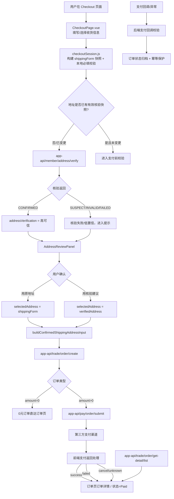

# 购物闭环流程图（可放大查看）

## 关键中间件与数据点

- **前端请求封装**：`yudaoRequest`（鉴权、tenant、错误规范化、响应映射）
- **网关 / 会话层**：登录态与租户上下文透传，订单支付上下文回传（`orderId / merchantOrderId / returnUrl`）
- **地址核验服务**：远程核验 + 本地回退，结果记录为 `addressVerification` 快照
- **交易服务层**：订单创建、支付提交参数约束、返回/回调验真与状态归档
- **订单页恢复层**：`order/get-detail/list` 驱动支付完成后的可恢复与风控态展示

## 节点数据传输摘要
- 入参地址：`shippingForm`（姓名/电话/国家/省市州/邮编/街道）
- 核验产物：`verificationId, source, addressStatus, confidence, suggestedAddress, warnings`
- 用户选择：`addressVerification.choice`（原地址/建议地址）与快照持久化
- 下单：`shippingAddress + addressVerification + cart/price + payChannel`
- 支付：`orderId/merchantOrderId + 回调参数 + 状态字段`
- 回调：订单归属与金额一致性校验通过后落库
