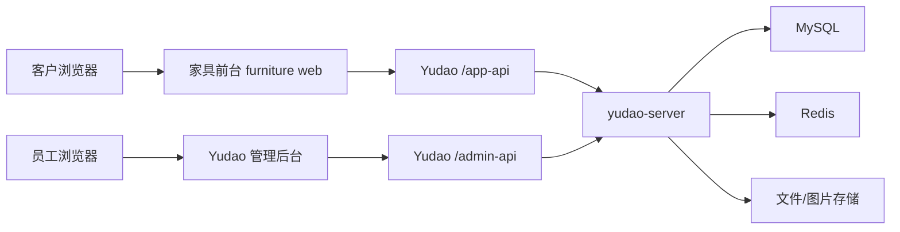

# 家具商城与 Yudao 商业化统一对接工程方案

## 1. 结论

采用“前台商城独立、管理后台独立、统一后端与数据库”的商业化架构。

```text
客户访问：furniture web
接口前缀：/app-api

员工访问：yudao-ui-admin-vue3
接口前缀：/admin-api

统一后端：yudao-server
统一数据：MySQL / Redis / 文件存储
```

该方案比“把商城页面塞进后台菜单”更适合商业系统。前台面向客户，后台面向员工，两者在权限、登录态、路由、部署和运营上保持清晰边界，后期也方便扩展支付、会员、订单、营销、库存等能力。

## 2. 项目现状

### 2.1 家具前台

路径：

```text
D:\code\furniture web
```

类型：

```text
Vue 3 + Vite
```

入口：

```text
src/main.js
src/App.vue
```

启动命令：

```powershell
cd "D:\code\furniture web"
npm.cmd run dev
```

当前已存在 Yudao 对接服务：

```text
src/services/yudaoClient.js
```

默认 App API 地址：

```text
http://127.0.0.1:48080/app-api
```

### 2.2 Yudao 管理后台

路径：

```text
D:\code\yudao电商管理平台前后端\yudao-ui-admin-vue3
```

类型：

```text
Vue 3 + Vite + TypeScript + Element Plus
```

入口：

```text
src/main.ts
```

启动命令：

```powershell
cd "D:\code\yudao电商管理平台前后端\yudao-ui-admin-vue3"
pnpm dev
```

本地接口配置：

```text
VITE_BASE_URL=http://localhost:48080
VITE_API_URL=/admin-api
```

### 2.3 Yudao 后端

路径：

```text
D:\code\yudao电商管理平台前后端\yudao-cloud
```

推荐启动入口：

```text
yudao-server/src/main/java/cn/iocoder/yudao/server/YudaoServerApplication.java
```

本地端口：

```text
48080
```

本地 profile：

```text
local
```

说明：`yudao-cloud` 还包含 Spring Cloud 微服务入口，例如 `yudao-gateway` 和多个 `*-server` 模块。商业化初期建议优先使用 `yudao-server` 聚合单体方式，启动成本更低，前后台都能先接到同一个后端。

## 3. 总体架构



生产环境推荐域名：

```text
https://www.example.com       前台商城
https://admin.example.com     管理后台
https://api.example.com       后端接口
```

开发环境推荐地址：

```text
http://127.0.0.1:5173         家具前台
http://127.0.0.1:5174         Yudao 管理后台，端口以 Vite 实际输出为准
http://127.0.0.1:48080        Yudao 后端
```

## 4. 职责边界

### 4.1 家具前台职责

家具前台只负责客户侧体验：

- 商品列表
- 商品详情
- 购物车
- 会员登录入口或 token 接入
- 地址选择
- 结算
- 下单
- 订单列表
- 订单详情

家具前台不得直接实现后台管理能力，不得调用 `/admin-api`。

### 4.2 Yudao 管理后台职责

Yudao 管理后台负责员工侧运营：

- 商品 SPU / SKU 管理
- 商品上下架
- 商品图片与详情维护
- 库存维护
- 订单管理
- 会员管理
- 配送配置
- 支付配置
- 权限和角色管理

管理后台不得暴露给普通客户使用。

### 4.3 Yudao 后端职责

Yudao 后端是唯一业务事实来源：

- 商品价格以后端为准
- 库存以后端为准
- 订单金额以后端计算为准
- 用户身份以后端 token 鉴权为准
- 订单状态以后端状态机为准
- 支付结果以后端回调校验为准

前端只提交必要参数，例如 `skuId`、`count`、`cartId`、`addressId`，不得提交可信价格。

## 5. 后端模块启用建议

当前 `yudao-server/pom.xml` 中商城相关模块处于注释状态。要让家具前台正常调用商品、购物车、订单接口，需要启用以下模块。

必需模块：

```text
yudao-module-member-server
yudao-module-product-server
yudao-module-trade-server
```

建议同步启用：

```text
yudao-module-promotion-server
```

后续接真实支付时再启用：

```text
yudao-module-pay-server
```

原因：

- `member` 提供 App 用户、地址等能力。
- `product` 提供商品列表、详情、SKU、分类等能力。
- `trade` 提供购物车、结算、下单、订单查询等能力。
- `promotion` 常被商城价格、营销配置依赖，建议随商城一起启用。
- `pay` 只有进入真实支付阶段才是必需。

启用模块后，需要确认数据库已导入对应 SQL，Redis 可用，文件上传配置可用。

## 6. API 对接范围

### 6.1 前台只允许调用 App API

商品：

```text
GET /app-api/product/spu/page
GET /app-api/product/spu/get-detail
GET /app-api/product/category/list
```

购物车：

```text
GET    /app-api/trade/cart/list
POST   /app-api/trade/cart/add
PUT    /app-api/trade/cart/update-count
DELETE /app-api/trade/cart/delete
```

地址：

```text
GET /app-api/member/address/list
GET /app-api/member/address/get-default
```

订单：

```text
GET  /app-api/trade/order/settlement
POST /app-api/trade/order/create
GET  /app-api/trade/order/page
GET  /app-api/trade/order/get-detail
```

支付，后续阶段：

```text
POST /app-api/pay/order/submit
GET  /app-api/pay/order/get
```

### 6.2 后台只调用 Admin API

管理后台继续使用现有 Yudao API：

```text
/admin-api
```

后台商品管理、订单管理、会员管理、权限管理不迁移到家具前台。

## 7. 认证与权限设计

### 7.1 登录态隔离

前台客户 token：

```text
YUDAO_APP_TOKEN
```

后台员工 token：

```text
Yudao 管理后台自身 token 机制
```

两类 token 不共用、不互相读取、不互相透传。

### 7.2 权限边界

客户权限：

- 查看已上架商品
- 管理自己的购物车
- 管理自己的地址
- 创建自己的订单
- 查看自己的订单

员工权限：

- 管理商品
- 管理订单
- 管理会员
- 管理库存
- 管理系统配置

### 7.3 安全要求

必须做到：

- 前台不得调用 `/admin-api`。
- 前台不得硬编码 token、账号、密码。
- 前台不得信任本地价格。
- 后端必须校验 token。
- 后端必须校验 SKU 状态、库存、价格、订单金额。
- 后端必须校验订单归属，客户只能查看自己的订单。
- 生产环境必须使用 HTTPS。
- 生产环境 CORS 只允许正式前台和后台域名。

建议做到：

- 登录 token 设置合理过期时间。
- 刷新 token 单独处理。
- 管理后台开启强密码和角色权限。
- 图片上传限制类型和大小。
- 重要接口记录操作日志。
- 支付回调必须验签。

## 8. 数据流

### 8.1 商品管理到前台展示

```text
员工在 Yudao 后台创建商品
-> 商品保存到 Yudao 数据库
-> 商品状态设置为上架
-> 家具前台调用 /app-api/product/spu/page
-> 前台展示商品列表
-> 客户进入详情页调用 /app-api/product/spu/get-detail
```

### 8.2 加入购物车

```text
客户点击 Add To Cart
-> 前台提交 skuId 和 count
-> /app-api/trade/cart/add
-> 后端校验商品、库存、用户身份
-> 返回购物车结果
-> 前台刷新 /app-api/trade/cart/list
```

### 8.3 结算下单

```text
客户进入 Checkout
-> 前台读取购物车和地址
-> 调用 /app-api/trade/order/settlement
-> 后端计算价格、运费、优惠、库存
-> 前台展示后端结算结果
-> 客户确认下单
-> 调用 /app-api/trade/order/create
-> 后端创建订单
-> 前台跳转订单详情
```

### 8.4 后台处理订单

```text
客户下单
-> 订单进入 Yudao 数据库
-> 员工在 Yudao 后台订单管理查看
-> 后续处理付款、发货、售后
```

## 9. 前台工程改造范围

建议将家具前台改造分为以下模块。

### 9.1 API 服务层

文件：

```text
src/services/yudaoClient.js
```

职责：

- 统一 App API base URL
- 统一 token header
- 统一解包 Yudao `CommonResult`
- 商品数据 mapper
- 购物车数据 mapper
- 地址数据 mapper
- 结算数据 mapper
- 订单数据 mapper

### 9.2 购物车服务

文件：

```text
src/services/localCart.js
```

职责：

- 本地购物车 fallback
- 后端不可用时保持页面可演示
- 不参与真实远程下单

### 9.3 结算服务

建议文件：

```text
src/services/checkoutSession.js
```

职责：

- 判断是否可以远程结算
- 构造 Yudao settlement payload
- 构造 Yudao create order payload
- 处理本地 demo 购物车预览

### 9.4 页面

建议保留现有轻量路由方式，逐步补齐：

```text
/sofas-plp
/sofa-pdp?id=<spuId>
/checkout
/orders
/orders?id=<orderId>
```

## 10. 后台工程改造范围

初期不改 Yudao 管理后台源码。只使用它已有的能力：

- 商品管理
- SKU 管理
- 商品上下架
- 订单管理
- 会员地址与用户管理
- 配送配置

如后续需要让后台展示“家具业务专属菜单”，建议优先通过 Yudao 菜单配置和权限配置完成，不直接改后台核心代码。

## 11. 部署建议

### 11.1 开发环境

```text
家具前台：npm.cmd run dev
Yudao 后台：pnpm dev
Yudao 后端：IDE 启动 YudaoServerApplication，profile=local
```

开发环境接口：

```text
家具前台 -> http://127.0.0.1:48080/app-api
Yudao 后台 -> http://localhost:48080/admin-api
```

### 11.2 生产环境

推荐 Nginx 或网关划分：

```text
www.example.com       -> furniture web dist
admin.example.com     -> yudao-ui-admin-vue3 dist
api.example.com       -> yudao-server
```

接口路径：

```text
https://api.example.com/app-api
https://api.example.com/admin-api
```

生产环境必须启用：

- HTTPS
- CORS 白名单
- 后端日志
- 数据库备份
- Redis 持久化或高可用策略
- 文件存储备份

## 12. 测试与验收

### 12.1 前台自动化验证

在家具前台运行：

```powershell
cd "D:\code\furniture web"
npm.cmd test
npm.cmd run build
```

需要覆盖：

- 商品 mapper
- 购物车 mapper
- 地址 mapper
- 结算 payload
- 订单 mapper
- token 读取与清除

### 12.2 后端启动验证

启动 `yudao-server` 后确认：

```text
http://127.0.0.1:48080/app-api/product/spu/page?pageNo=1&pageSize=10
http://127.0.0.1:48080/admin-api
```

商品接口应返回 Yudao 标准结果结构：

```json
{
  "code": 0,
  "data": {
    "list": [],
    "total": 0
  }
}
```

说明：具体 `code` 成功值以当前 Yudao 后端 App API 为准，家具前台需要兼容实际返回结构。

### 12.3 业务验收清单

商品：

- 后台新增商品后，前台商品列表可见。
- 下架商品不在前台展示。
- 商品详情图片、价格、库存正常展示。

购物车：

- 已登录客户可加入购物车。
- 购物车数量可修改。
- 购物车商品可删除。
- 未登录或后端不可用时有清晰提示或本地 fallback。

结算：

- 前台展示后端结算金额。
- 前台不能篡改价格完成下单。
- 无地址时提示客户补充地址。

订单：

- 前台可创建订单。
- 前台可查看自己的订单列表和详情。
- 后台可看到同一笔订单。

安全：

- 前台无法访问后台接口。
- 客户 token 不能访问 `/admin-api`。
- 后台 token 不能被家具前台读取。
- 订单详情必须校验用户归属。

## 13. 分阶段实施计划

### Phase 1：打通最小闭环

目标：

```text
后台维护商品 -> 前台展示商品 -> 加入购物车 -> 创建订单 -> 后台看到订单
```

范围：

- 启用 Yudao `member`、`product`、`trade` 模块。
- 确认数据库和 Redis 可用。
- 家具前台补齐地址、结算、订单接口。
- 保持前台和后台独立启动。

### Phase 2：完善客户体验

目标：

```text
客户可以稳定登录、查看订单、管理地址
```

范围：

- 完整 App 用户登录。
- 地址新增、编辑、删除。
- 订单状态展示。
- 错误提示和 loading 状态完善。

### Phase 3：商业支付与履约

目标：

```text
支持真实支付、发货、售后
```

范围：

- 启用 `pay` 模块。
- 配置支付渠道。
- 接支付回调。
- 订单支付状态联动。
- 后台发货流程。

### Phase 4：生产部署与运营

目标：

```text
正式上线可运营
```

范围：

- 域名和 HTTPS。
- Nginx / 网关配置。
- CORS 白名单。
- 数据备份。
- 日志监控。
- 权限分配。
- 基础安全检查。

## 14. 风险与处理

### 14.1 Yudao 商城模块未启用

风险：

```text
/app-api/product 和 /app-api/trade 接口不可用
```

处理：

```text
启用 yudao-server 的 member、product、trade 模块，并导入对应 SQL。
```

### 14.2 App 用户登录未完成

风险：

```text
购物车、地址、下单接口需要客户 token。
```

处理：

```text
开发阶段可使用临时 YUDAO_APP_TOKEN 联调；商业上线前必须实现完整客户登录流程。
```

### 14.3 价格单位不一致

风险：

```text
Yudao 常用“分”为价格单位，前台展示可能是“元”或美元金额。
```

处理：

```text
所有价格转换集中在 yudaoClient.js，不允许页面重复转换。
```

### 14.4 前后台权限混用

风险：

```text
客户误用后台 token 或前台误调 admin-api。
```

处理：

```text
前台代码只允许出现 /app-api；后台代码只使用 /admin-api；上线前做接口扫描。
```

### 14.5 生产跨域配置过宽

风险：

```text
任意来源可调用接口。
```

处理：

```text
CORS 只允许正式前台域名和后台域名。
```

## 15. 决策记录

已确认采用：

```text
前台商城独立 + 管理后台独立 + 统一 Yudao 后端与数据库
```

不采用：

```text
把家具商城页面直接合并进 Yudao 管理后台菜单
```

理由：

- 商业规范更清晰。
- 客户侧和员工侧权限隔离。
- 前台可以独立优化用户体验。
- 后台可以继续使用 Yudao 完整管理能力。
- 部署和后期扩展更稳定。

## 16. 下一步建议

优先执行 Phase 1。具体顺序：

1. 确认 `yudao-server` 可以本地启动。
2. 启用 `member`、`product`、`trade` 模块。
3. 导入商城相关 SQL。
4. 在 Yudao 后台新增一个上架商品。
5. 用家具前台调用 `/app-api/product/spu/page` 验证商品展示。
6. 接入 App 用户 token。
7. 验证购物车、结算、下单、后台订单查看。

