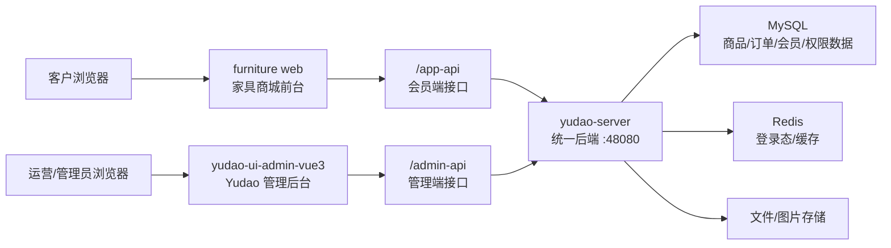
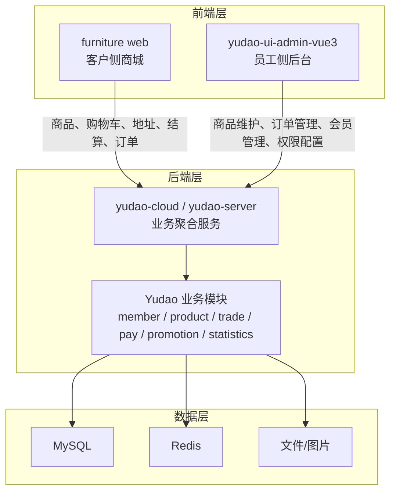
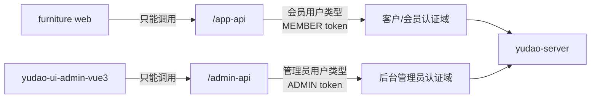
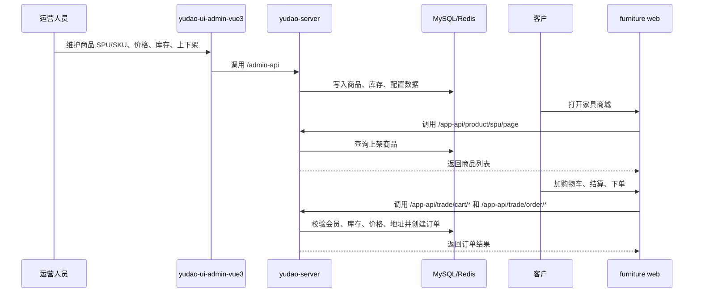
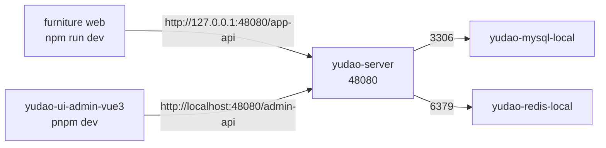

# Furniture Web / Yudao Web / Yudao Cloud 项目关系图

## 总览

本项目采用“客户前台独立、运营后台独立、统一后端与数据库”的结构。

## 三个项目的职责

## API 边界

## 家具商城核心业务流

## 本地联调关系

## 结论

- `furniture web` 是客户侧商城，负责品牌化购物体验。
- `yudao-ui-admin-vue3` 是员工侧后台，负责商品、订单、会员、权限等运营管理。
- `yudao-cloud / yudao-server` 是统一业务后端，是商品、库存、订单、会员和支付等数据的事实来源。
- 前台必须走 `/app-api`，后台必须走 `/admin-api`，两套 token 和用户类型不能混用。
