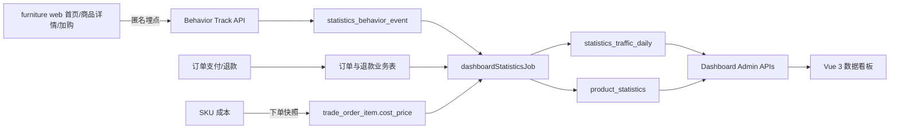

# 家具电商数据看板开发设计

> 状态：待业务评审
> 日期：2026-07-10
> 适用项目：`furniture web` 家具前台、`yudao-cloud` 后端、`yudao-ui-admin-vue3` 管理后台

## 1. 文档目的

本文档定义一期“数据看板”的业务口径、用户体验、埋点规则、数据模型、后端接口、前端页面、权限、异常处理、测试与验收标准。

实施目标是在现有管理后台新增一个独立一级导航“数据看板”，用于持续查看家具前台站点访问、商品访问、订单转化、销售额、成本和毛利等核心电商指标。

## 2. 现状和已知缺口

### 2.1 现有能力

- 芋道已有商品统计、交易统计、会员统计、排行榜、对比分析和 Excel 导出能力。
- `yudao-server` 已聚合 `yudao-module-statistics-server`，可在当前家具电商部署模式中继续扩展。
- 商品详情接口每次成功请求会累加 `product_spu.browse_count`。
- 已有 `product_statistics` 日统计，包含浏览、访客、收藏、加购、下单、支付、退款和转化率字段。
- 商品 SPU 和 SKU 已有成本价字段。

### 2.2 必须修复的缺口

- 当前没有独立的“数据看板”导航和聚合页面。
- 首页 `/` 没有独立访问埋点，无法准确统计首页 PV、UV 和趋势。
- 当前 `product_browse_history` 仅保存已登录用户，且同一用户对同一商品只保留最新一条，不能作为全量商品详情页 PV 数据源。
- 当前商品统计的转化率口径是“支付件数 ÷ 去重登录访客数”，与本项目需要的“支付订单数 ÷ 商品详情 PV”不一致。
- `trade_order_item` 没有保存下单当时的成本价，商品成本价后续变更会导致历史毛利失真。
- 现有统计任务以“昨日批处理”为主，不能满足看板当日数据的时效性。

## 3. 实现路线对比

### 3.1 方案 A：扩展现有芋道 Statistics 模块（推荐）

在 `yudao-module-statistics-server` 中新增访问事件、看板聚合、毛利统计和管理端接口；继续复用现有商品、订单、退款和权限体系。

优点：

- 与当前聚合部署、租户、权限、Excel 导出和 MyBatis 规范一致。
- 可复用现有 `product_statistics` 与商城统计前端组件。
- 不增加新服务的部署、注册中心、数据源和运维成本。

代价：

- 需要对现有商品统计口径做兼容扩展。
- 需要一次数据库迁移和历史数据回填。

### 3.2 方案 B：新建独立 Analytics 微服务

将埋点、访问事件、订单同步和看板查询全部拆到新服务。

优点：模块边界最清晰，便于未来接入消息队列、数据仓库和海量事件。

代价：当前业务规模下过度设计；需要新的部署、数据同步、权限和运维体系，一期成本最高。

### 3.3 方案 C：仅接入第三方网站分析

使用 Google Analytics、Plausible 或同类平台完成 PV、UV 和页面访问分析，后台只展示或跳转第三方报表。

优点：网站流量埋点快，有现成的来源、设备和地域分析。

代价：难以与芋道订单、成本、退款和商品权限做可靠联表；存在外部依赖、隐私合规和数据归属问题。

### 3.4 选型结论

一期采用方案 A。数据模型保留原始事件和日聚合层，以便业务量增长后再向独立分析服务平滑迁移。

## 4. 一期范围

### 4.1 必须实现

- 独立一级导航“数据看板”。
- 首页 PV、UV 及按日趋势。
- 商品详情页 PV、UV 及按日趋势。
- 支付订单数、支付件数、净销售额、退款额。
- 商品成本快照、毛利额、毛利率。
- 站点转化率和商品转化率。
- 加购率、客单价、退款率等常规辅助指标。
- 最近 7 天、30 天、90 天及自定义日期范围。
- 按商品和商品分类筛选。
- 当前区间与等长上一区间的环比。
- 商品表现排行榜、排序、分页和 Excel 导出。
- 数据更新时间、统计延迟和历史毛利估算标识。

### 4.2 一期不实现

- 秒级实时大屏。
- 广告渠道 ROI、UTM 归因、首次/末次触点归因。
- 跨设备用户身份合并。
- 用户热力图、会话录屏和 A/B 测试。
- 包含税费、支付手续费、人工、仓储和分摊运费的会计净利润。
- 拖拽式报表或大屏设计器。
- 第三方分析平台数据回传。

## 5. 用户和使用场景

### 5.1 目标用户

- 电商运营：关注访问、加购、订单、转化和商品排行。
- 商品管理：关注单品流量、销售、退款、毛利和异常。
- 财务或管理者：关注净销售额、成本、毛利、毛利率和数据口径。

### 5.2 核心使用场景

1. 运营人员进入“数据看板”，默认看到最近 30 天数据及相比前 30 天的变化。
2. 运营人员切换 7/30/90 天或自定义日期，所有卡片、图表和表格同步刷新。
3. 运营人员按分类或商品筛选，查看单品的访问、订单、收入、毛利和转化。
4. 商品管理通过排行表定位“高流量低转化”、“高销售低毛利”和“高退款”商品。
5. 管理者导出当前筛选条件下的商品表现明细。

## 6. 指标口径

所有时间口径使用 `Asia/Shanghai`。日期区间按前端选择的起始日 `00:00:00` 到结束日的下一天 `00:00:00` 左闭右开计算。

| 指标 | 一期口径 |
|---|---|
| 首页 PV | 路径精确为 `/` 的成功页面进入次数。首次加载、内部导航返回首页、用户主动刷新各计 1 次。 |
| 首页 UV | 按自然日对访客标识去重。已登录用户关联用户编号，未登录用户使用匿名访客标识。 |
| 商品详情 PV | 商品详情 `/product?id={spuId}` 数据加载成功后计 1 次。无效商品、加载失败和纯 API 重试不计入。 |
| 商品详情 UV | 按“自然日 + 商品 + 访客标识”去重。 |
| 加购次数 | 商品成功加入购物车后计 1 次；接口失败或本地预览回退不计入真实加购。 |
| 加购率 | 有成功加购的访客数 ÷ 商品详情 UV × 100%。 |
| 支付订单数 | 统计区间内支付成功的去重订单数。取消和未支付订单不计入。 |
| 支付件数 | 支付成功订单的商品数量之和。 |
| 站点 PV 转化率 | 支付订单数 ÷ 首页 PV × 100%。此口径与本期业务需求保持一致。 |
| 站点 UV 转化率 | 支付买家数 ÷ 首页 UV × 100%，作为辅助指标展示。 |
| 商品转化率 | 包含该商品的支付订单数 ÷ 该商品详情 PV × 100%。分子按订单去重，不使用商品件数。 |
| 商品 UV 转化率 | 购买该商品的去重买家数 ÷ 该商品详情 UV × 100%，作为辅助指标。 |
| 支付销售额 | 支付订单商品明细 `pay_price` 之和。不包含订单税费和额外运费。 |
| 退款额 | 已退款成功的商品退款金额之和。 |
| 净销售额 | 支付销售额 - 退款额。 |
| 成本金额 | 已支付且未成功退回库存的净销售件数 × 订单明细的下单成本快照。 |
| 商品毛利 | 净销售额 - 成本金额。 |
| 商品毛利率 | 商品毛利 ÷ 净销售额 × 100%。净销售额为 0 时返回 0。 |
| 客单价 | 净销售额 ÷ 支付订单数。 |
| 退款率 | 退款额 ÷ 支付销售额 × 100%。 |
| 环比 | 当前区间与紧邻之前的等长区间对比：`(当前值 - 对比值) ÷ 对比值`。对比值为 0 时不显示百分比，改显示“无可比数据”。 |

### 6.1 退款与成本的特殊规则

- 退货并恢复库存：减少净销售额，同时减少对应返回商品的成本。
- 仅退款不退货：减少净销售额，不减少成本。
- 部分退款：按成功退款金额减少净销售额；仅在有明确退货件数时减少对应成本。
- 未支付、支付关闭或退款未成功状态不影响净销售额和毛利。

## 7. 埋点设计

### 7.1 事件类型

| 事件 | 触发时机 | 关键维度 |
|---|---|---|
| `HOME_VIEW` | 首页首次渲染或 SPA 导航进入 `/` | 访客、会话、路径、来源 |
| `PRODUCT_DETAIL_VIEW` | 商品详情数据加载成功 | 访客、会话、SPU、路径、来源 |
| `ADD_TO_CART` | 真实加购接口成功 | 访客、会话、SPU、SKU、数量 |
| `CHECKOUT_START` | 用户从购物车进入真实结算流程 | 访客、会话、购物车商品数 |

支付成功不依赖前端埋点，必须以后端订单支付状态为准，防止前端事件丢失或重复导致财务指标错误。

### 7.2 访客与会话

- 前台首次访问时生成 UUID 作为 `visitorId`，保存在 `localStorage`。
- 会话 30 分钟无操作后失效；新会话生成新 `sessionId`。
- 已登录用户由后端从访问令牌解析 `userId`，后端不接受前端传入的用户编号。
- 后端对 `visitorId` 和 `sessionId` 做带服务端密钥的哈希后存储，不保存原始标识。

### 7.3 重复事件和刷量控制

- 每个事件生成全局唯一 `eventId`，后端依据唯一索引实现幂等。
- 同一访客、同一页面、同一商品在 5 秒内的重复事件仅保留 1 条，用于消除组件重复挂载和网络重试；用户主动刷新且超过 5 秒时仍计为新 PV。
- 追踪接口按访客和请求 IP 做速率限制，默认每分钟不超过 120 条。
- 过滤常见搜索引擎、监控器和自动化测试 User-Agent；被标识为机器人的数据不进入业务指标。

### 7.4 上报策略

- 前端新增独立 `analytics` 服务，不在页面组件内散落拼接请求。
- 统一复用家具前台 `requestYudao` 并设置 `keepalive: true`，以保留 `tenant-id` 和可选会员令牌；不使用无法设置这些请求头的 `navigator.sendBeacon`。
- 埋点失败不阻止页面展示、加购或结算，不向普通用户弹出错误提示。
- 事件上报超时设为 2 秒，最多重试 1 次，重试复用原 `eventId`。

## 8. 数据模型

### 8.1 原始行为事件表 `statistics_behavior_event`

| 字段 | 类型要求 | 说明 |
|---|---|---|
| `id` | bigint | 主键 |
| `tenant_id` | bigint | 租户编号 |
| `event_id` | varchar(64) | 客户端事件唯一标识，唯一索引 |
| `event_type` | tinyint | 首页访问、商品详情访问、加购、开始结算 |
| `visitor_hash` | char(64) | 匿名访客哈希 |
| `session_hash` | char(64) | 会话哈希 |
| `user_id` | bigint nullable | 已登录会员编号 |
| `spu_id` | bigint nullable | 商品 SPU 编号 |
| `sku_id` | bigint nullable | 商品 SKU 编号 |
| `quantity` | int nullable | 加购数量 |
| `page_path` | varchar(255) | 标准化页面路径，不保存敏感查询参数 |
| `referrer_host` | varchar(255) nullable | 来源域名，不保存完整来源 URL |
| `device_type` | tinyint | desktop / mobile / tablet / other |
| `occurred_at` | datetime | 客户端发生时间，超出服务器前后 24 小时时改用服务器时间 |
| `create_time` | datetime | 服务器入库时间 |

索引：

- 唯一索引 `(tenant_id, event_id)`。
- 查询索引 `(tenant_id, event_type, occurred_at)`。
- 商品查询索引 `(tenant_id, spu_id, event_type, occurred_at)`。
- UV 聚合索引 `(tenant_id, occurred_at, visitor_hash)`。

### 8.2 站点日聚合表 `statistics_traffic_daily`

| 字段 | 说明 |
|---|---|
| `tenant_id`, `day` | 唯一键 |
| `home_pv`, `home_uv` | 首页 PV / UV |
| `product_detail_pv`, `product_detail_uv` | 全站商品详情 PV / UV |
| `add_cart_count`, `add_cart_user_count` | 加购次数 / 加购访客数 |
| `checkout_start_count` | 开始结算会话数，按 `session_hash` 去重 |
| `paid_order_count`, `paid_buyer_count` | 支付订单数 / 支付买家数 |
| `paid_item_count` | 支付件数 |
| `paid_revenue` | 支付销售额，单位：分 |
| `refund_amount` | 成功退款额，单位：分 |
| `net_revenue` | 净销售额，单位：分 |
| `cost_amount` | 成本金额，单位：分 |
| `gross_profit` | 商品毛利，单位：分 |
| `estimated_cost_item_count` | 使用估算历史成本的订单明细数 |
| `update_time` | 最后聚合时间 |

### 8.3 复用并扩展 `product_statistics`

保留现有字段，但将 `browse_count` 和 `browse_user_count` 的数据源改为 `PRODUCT_DETAIL_VIEW` 原始事件。新增：

- `paid_order_count`：包含该商品的去重支付订单数。
- `paid_buyer_count`：购买该商品的去重用户数。
- `cost_amount`：商品净销售成本。
- `gross_profit`：商品毛利。
- `gross_margin_percent`：商品毛利率。
- `estimated_cost_item_count`：当日使用估算成本的订单明细数。

现有 `order_pay_count` 继续表示支付件数，不改名，避免破坏旧接口；新增 `paid_order_count` 专门用于订单转化率。

`product_spu.browse_count` 作为现有商品累计浏览数继续保留，不作为看板日统计数据源。看板 PV/UV 仅来自 `statistics_behavior_event`，避免与现有详情接口的累加逻辑发生双重计数。

### 8.4 订单成本快照

`trade_order_item` 新增：

- `cost_price` int nullable：下单时对应 SKU 的单件成本价，单位分。
- `cost_estimated` bit not null default 0：是否为历史回填估算成本。

新订单创建时必须从 SKU 数据快照成本价，不允许在看板查询时直接使用商品当前成本价代替。

历史订单迁移规则：

1. 按订单明细的 SKU 查询当前成本价回填 `cost_price`。
2. 回填成功的历史记录设置 `cost_estimated = 1`。
3. SKU 已删除且无法找到成本时，`cost_price` 保持空；看板将该时间范围标记为“成本数据不完整”，不将空成本当作 0。

## 9. 聚合和数据时效

### 9.1 聚合任务

新增 `dashboardStatisticsJob`，按租户执行：

- 每 5 分钟重算当日数据，保证看板延迟不超过 10 分钟。
- 每日 `00:10` 最终重算昨日数据。
- 支持传入正整数天数重算历史数据，用于回填和故障恢复。
- 采用按日删除后重算或唯一键 upsert，不允许因“数据已存在”跳过迟到订单、退款或埋点。

### 9.2 原始数据保留

- 原始行为事件保留 180 天。
- 日聚合数据长期保留。
- 每日执行清理任务，只删除超过保留期且已完成聚合的原始事件。

### 9.3 数据质量标识

看板接口返回 `profitDataQuality`：

- `EXACT`：选定区间的成本均来自下单快照。
- `MIXED`：同时包含快照成本和历史估算成本。
- `ESTIMATED`：选定区间仅包含历史估算成本。
- `INCOMPLETE`：存在无法回填成本的订单明细。

页面必须使用提示标识解释 `MIXED`/`ESTIMATED`/`INCOMPLETE`，不得将估算毛利伪装为精确财务数据。

## 10. 后端接口

### 10.1 前台埋点接口

`POST /app-api/statistics/behavior/track`

请求字段：

```json
{
  "eventId": "uuid",
  "eventType": "HOME_VIEW",
  "visitorId": "anonymous-uuid",
  "sessionId": "session-uuid",
  "spuId": null,
  "skuId": null,
  "quantity": null,
  "pagePath": "/",
  "referrer": "https://example.com/",
  "occurredAt": "2026-07-10T10:30:00+08:00"
}
```

接口规则：

- 允许匿名访问，有访问令牌时关联会员。
- 仅接受白名单事件类型。
- `PRODUCT_DETAIL_VIEW` 和 `ADD_TO_CART` 必须包含有效 `spuId`。
- 后端校验商品存在性，但追踪失败不反向影响商品页业务接口。
- 成功接收或幂等重复时均返回成功。

### 10.2 看板汇总

`GET /admin-api/statistics/dashboard/summary`

查询参数：

- `times[0]`, `times[1]`：必填，最大时间跨度 366 天。
- `categoryId`：可选。
- `spuId`：可选，选择商品后优先于分类。

返回 `DataComparisonRespVO<DashboardSummaryRespVO>`，包含：

- 首页 PV/UV、商品详情 PV/UV。
- 加购次数、支付订单数、支付件数。
- 支付销售额、退款额、净销售额、成本、毛利、毛利率。
- PV 转化率、UV 转化率、加购率、客单价、退款率。
- `profitDataQuality` 和 `lastUpdatedAt`。

### 10.3 看板趋势

`GET /admin-api/statistics/dashboard/trend`

查询参数同汇总接口，另包含 `granularity=DAY`。一期只支持日粒度。

每日返回：

- `day`
- `homePv`, `homeUv`
- `productDetailPv`, `productDetailUv`
- `paidOrderCount`
- `netRevenue`
- `grossProfit`
- `siteConversionPercent`

没有数据的日期必须补 0，保证 ECharts 时间轴连续。

### 10.4 漏斗

`GET /admin-api/statistics/dashboard/funnel`

返回首页 UV、商品详情 UV、加购访客数、开始结算会话数、支付买家数，以及每一步对上一步的转化率。

### 10.5 商品表现分页

`GET /admin-api/statistics/dashboard/product-page`

支持：

- 日期、分类、商品名称/编码。
- 分页和按 PV、UV、支付订单、净销售额、毛利、毛利率、转化率、退款率排序。

列字段：

- SPU 编号、商品图、商品名称、分类。
- 详情 PV/UV、加购次数。
- 支付订单数、支付件数。
- 净销售额、成本、毛利、毛利率。
- 商品转化率、退款率。
- 毛利数据质量标识。

### 10.6 导出

`GET /admin-api/statistics/dashboard/export-product-excel`

导出必须严格复用当前页面筛选和排序条件，金额在 Excel 中以元显示，原始存储仍使用分。

## 11. 导航和权限

### 11.1 菜单

- 名称：数据看板
- 层级：一级菜单，直接打开看板，一期不再增加无意义的二级目录。
- 路径：`/dashboard`
- 组件：`dashboard/index`
- 组件名：`DataDashboard`
- 图标：`ep:data-analysis`
- 菜单权限：`statistics:dashboard:query`
- 导出权限：`statistics:dashboard:export`

菜单记录通过幂等 SQL 迁移新增，按 `path=/dashboard` 判断是否已存在，不在本规格中硬编码可能与环境冲突的菜单主键。

### 11.2 Furniture Lite

当前前端启用 `furniture-lite`，必须将 `/dashboard` 加入 `allowedMenuPaths`，否则后端菜单创建成功后仍会被前端过滤。

### 11.3 角色

- 管理员默认获得查询和导出权限。
- 运营角色默认获得查询权限。
- 导出权限单独控制，不因可查看看板而自动开放。
- 所有查询必须保留芋道租户隔离，不允许跨租户聚合。

## 12. 管理端页面设计

### 12.1 视觉参考

参考 [shadcn/ui `dashboard-01`](https://ui.shadcn.com/view/new-york-v4/dashboard-01) 的内容布局和视觉层级，不直接执行 `npx shadcn@latest add dashboard-01`。

原因：参考块使用 React、Tailwind CSS 和 shadcn/Radix 组件，当前管理端使用 Vue 3、Element Plus、UnoCSS 和 ECharts。直接安装会引入不兼容的运行时和重复设计系统。

改写原则：

- 保留芋道现有左侧导航、顶部栏、面包屑和页签系统。
- 仅将 `dashboard-01` 的看板内容区转换为 Vue/Element Plus 实现。
- 使用低饱和黑白灰、1px 边框、8至 12px 圆角、轻或无阴影、紧凑但有呼吸感的间距。
- 颜色继续使用当前 `furniture-admin.scss` 的中性色变量，不新建另一套主题。
- 上涨使用低饱和绿色，下降使用低饱和红色，估算/不完整数据使用黄褐色提示。

### 12.2 组件映射

| shadcn 概念 | 当前项目实现 |
|---|---|
| Card | `el-card` + 项目定制边框样式 |
| Toggle Group | `el-segmented` |
| Date Range | `el-date-picker` daterange |
| Select | `el-select` |
| Data Table | `el-table` + `Pagination` |
| Badge | `el-tag` |
| Area/Line Chart | 现有 `Echart` 组件 + ECharts |
| Icons | 现有 `Icon` + Element Plus/Iconify 图标 |
| Skeleton | `el-skeleton` |

### 12.3 页面结构

1. **页头**
   - 标题“数据看板”。
   - 副标题“访问、转化与商品盈利表现”。
   - 展示“数据更新于 HH:mm”。
   - 右侧放置刷新和导出操作。

2. **全局筛选栏**
   - 7 天 / 30 天 / 90 天快捷切换，默认 30 天。
   - 自定义日期范围，最大 366 天。
   - 商品分类筛选。
   - 商品筛选，支持商品名称或 SPU 编号搜索。
   - “对比上一周期”默认开启。

3. **四张主指标卡**
   - 首页浏览量。
   - 商品详情浏览量。
   - 支付订单数。
   - 商品毛利。

   每张卡包含当前值、环比标签、一句简短解读和口径提示。毛利卡同时展示数据质量状态。

4. **辅助指标条**
   - 净销售额。
   - 商品转化率。
   - 客单价。
   - 退款率。

5. **主趋势图**
   - 默认展示“首页 PV”与“商品详情 PV”的双线/双面积图。
   - 可切换“流量”、“订单”、“收入”、“毛利”和“转化”。
   - 鼠标悬浮显示当日值和环比。
   - 日期区间超过 90 天时仍保持日粒度，但自动降低 X 轴标签密度。

6. **转化漏斗**
   - 首页 UV → 商品详情 UV → 加购访客 → 开始结算 → 支付买家。
   - 展示每一层数值、对上一层转化率和最大流失环节。

7. **商品表现表**
   - 默认按商品详情 PV 倒序。
   - 支持自定义显示列，但商品、PV、支付订单、毛利和转化率不可全部隐藏。
   - 商品名称可点击打开现有后台商品编辑/详情页。
   - 支持分页、排序、空数据和导出。

### 12.4 响应式

- 大屏：主卡片 4 列，趋势图与漏斗按 2:1 布局。
- 中屏：主卡片 2 列，趋势图和漏斗纵向堆叠。
- 小屏：主卡片 1 列，筛选项折叠到“筛选”抽屉，商品表允许水平滚动。

### 12.5 状态设计

- 初次加载：使用与最终布局一致的骨架屏，避免页面跳动。
- 局部刷新：保留原数据，仅在筛选栏和相关区块显示加载。
- 空数据：明确显示“当前条件下暂无数据”，不伪造 0 值趋势。
- 部分失败：指标卡、趋势图、漏斗和表格独立显示重试，不因单个接口失败让整页不可用。
- 聚合过期：`lastUpdatedAt` 超过 20 分钟时显示“数据更新延迟”提示。

## 13. 数据流



## 14. 异常处理和隐私

### 14.1 埋点故障

- 埋点接口异常不得影响前台购物流程。
- 后端指标监控埋点失败率、被限流数和重复事件数。
- 连续 15 分钟入库数为 0 但站点仍有正常请求时产生告警。

### 14.2 聚合故障

- 任务必须幂等，同一天可重复执行。
- 任务失败记录租户、日期和处理阶段，不记录原始访客标识。
- 看板保留上次成功聚合数据，并明示数据延迟，不因任务失败展示全 0。

### 14.3 隐私

- 不存储原始 IP、完整 Referrer URL、访问令牌、邮箱、手机号或完整 User-Agent。
- 匿名访客标识仅用于统计去重，不用于个人营销画像。
- 如目标部署地区要求分析同意，前台需在用户同意分析 Cookie/本地存储后才创建 `visitorId`；未同意前只允许不可识别的汇总访问。

## 15. 性能要求

- 埋点接口 P95 响应时间不超过 200ms，接口只做校验、哈希和单条入库。
- 看板汇总和趋势接口在 30 天范围 P95 不超过 800ms。
- 商品表现分页在 1 万个 SPU 日统计数据量下 P95 不超过 1.5s。
- 默认分页 20 条，单页最多 100 条。
- 页面首次加载允许并行请求汇总、趋势、漏斗和商品表现，单个接口失败不取消其他接口。
- 同一用户相同筛选条件在 30 秒内可使用服务端或前端短缓存，手动刷新必须跳过前端缓存。

## 16. 预计文件变更

### 16.1 `furniture web`

- 新增 `src/services/analytics.js`：访客/会话管理、事件去重和上报。
- 修改 `src/App.vue`：首页导航成功后上报 `HOME_VIEW`。
- 修改 `src/pages/SofaPdpPage.vue`：商品详情成功加载后上报 `PRODUCT_DETAIL_VIEW`。
- 修改购物车与结算入口：业务成功后上报 `ADD_TO_CART`/`CHECKOUT_START`。
- 新增埋点单元测试和 SPA 导航重复事件回归测试。

### 16.2 `yudao-cloud`

- Statistics 模块新增 behavior event 的 DO、Mapper、Service、App Controller 和校验 VO。
- Statistics 模块新增 dashboard 的 Admin Controller、Service、Mapper 和 VO。
- 扩展 Product Statistics 的统计口径与字段。
- 新增 `dashboardStatisticsJob`。
- 订单创建流程写入 SKU 成本快照。
- 新增 MySQL 数据迁移、菜单/权限 SQL 和历史成本回填脚本。
- 数据库兼容范围一期以当前家具项目使用的 MySQL 为准；其他芋道数据库方言在后续单独补齐。

### 16.3 `yudao-ui-admin-vue3`

- 新增 `src/api/mall/statistics/dashboard.ts`。
- 新增 `src/views/dashboard/index.vue`。
- 拆分 `DashboardMetricCard.vue`、`DashboardTrendChart.vue`、`DashboardFunnel.vue`、`DashboardProductTable.vue`、`DashboardFilters.vue`。
- 修改 `src/config/furnitureLite.ts` 放行 `/dashboard`。
- 扩展 `src/styles/furniture-admin.scss` 的看板内容区样式，不改变全局后台导航结构。
- 新增 API 类型、组件行为和筛选同步测试。

## 17. 测试要求

### 17.1 后端单元测试

- 事件类型、必填字段、商品存在性和时间校验。
- `eventId` 幂等和 5 秒重复事件规则。
- 未登录与已登录访客的 UV 去重。
- 站点转化率、商品转化率、加购率和分母为 0 的处理。
- 净销售额、退货成本转回、仅退款不退货和部分退款。
- `EXACT`/`MIXED`/`ESTIMATED`/`INCOMPLETE` 毛利数据质量判定。
- 租户隔离和权限拒绝。

### 17.2 Mapper/集成测试

- 原始事件索引和唯一键。
- 按日补 0、跨月和闰日区间。
- 同一订单包含多件同商品时，支付订单数只计 1，支付件数按数量累加。
- 取消、未支付、已支付和部分/全额退款数据组合。
- 按分类、SPU 和租户筛选。
- 按各指标排序的商品分页。

### 17.3 家具前台测试

- 首次打开 `/` 只上报一条 `HOME_VIEW`。
- SPA 从其他页返回 `/` 上报新的 `HOME_VIEW`。
- 商品加载成功上报 `PRODUCT_DETAIL_VIEW`，商品不存在不上报。
- 接口重试和组件重复挂载不产生 5 秒内重复记录。
- 埋点接口失败不影响页面、加购和结算。

### 17.4 管理后台测试

- 默认最近 30 天并开启上一周期对比。
- 快捷日期与自定义日期正确同步所有组件。
- 分类和商品筛选不互相冲突。
- 指标卡、趋势、漏斗和商品表展示一致的筛选口径。
- 上涨、下降、无法对比、空数据、部分失败和聚合过期状态。
- 数据质量标识和口径提示可访问。
- 无导出权限时不显示导出操作，并且直接调用接口会被拒绝。
- 1440px、1024px 和 390px 宽度下无遮挡、溢出和裁切错误。

## 18. 验收标准

1. 具备权限的用户登录后，左侧出现独立“数据看板”导航，点击进入 `/dashboard`。
2. 默认展示最近 30 天，并对比前 30 天。
3. 首页每次真实进入、返回或刷新在排除 5 秒重复事件后会产生 1 个 PV。
4. 商品详情数据加载成功后产生 1 个对应 SPU 的详情 PV，匿名用户也会被统计。
5. 自定义日期、分类和商品筛选作用于整个看板。
6. 商品转化率严格等于包含该 SPU 的去重支付订单数除以该 SPU 的详情 PV。
7. 新订单的毛利使用下单成本快照；历史估算成本与不完整成本会被明确标识。
8. 退货、仅退款、部分退款的销售额和成本处理符合第 6.1 节。
9. 看板当日数据正常情况下延迟不超过 10 分钟。
10. 商品表支持排序、分页和按当前条件导出 Excel。
11. 埋点服务不可用时，家具前台的浏览、加购、结算和下单仍正常工作。
12. 页面在桌面、平板和手机宽度下保持可用，视觉层级与 shadcn `dashboard-01` 参考一致，但不引入 React/shadcn 运行时。

## 19. 发布与回滚

### 19.1 发布顺序

1. 先执行数据库迁移，新表和字段对旧应用保持兼容。
2. 发布后端埋点、成本快照、聚合任务和看板接口。
3. 配置并验证 `dashboardStatisticsJob`，对最近 30 天执行回填。
4. 发布家具前台埋点，观察事件入库和错误率。
5. 发布管理端看板和菜单权限。
6. 先向管理员和少量运营角色开放，验收数据口径后再扩大角色范围。

### 19.2 回滚

- 通过菜单权限和 `furniture-lite` 白名单关闭看板入口。
- 前台埋点可通过环境开关停止上报。
- 后端在关闭看板后仍保留新增表和成本字段，不执行破坏性回滚，避免丢失已采集数据。
- 旧商城统计菜单和接口保持可用。

## 20. 评审时重点确认

本文档已按常规电商平台做出以下默认决策，评审时如不调整，将按此进入实施计划：

1. 一期采用扩展现有 Statistics 模块，不新建微服务。
2. 数据看板是直达页面的一级导航。
3. 默认时间范围为最近 30 天，默认对比前 30 天。
4. 首页 PV 以真实进入 `/` 为准，商品 PV 以商品详情加载成功为准。
5. 主转化率按“支付订单数 ÷ PV”，另展示 UV 转化率作为辅助指标。
6. 毛利按“净销售额 - 净销售商品的下单成本快照”计算，不视为会计净利润。
7. 历史成本使用当前 SKU 成本回填并标记为估算，无法回填时标记数据不完整。
8. 埋点异常不影响交易主链路。
9. 视觉参考 shadcn `dashboard-01`，但使用 Vue 3 + Element Plus + ECharts 原生改写。
