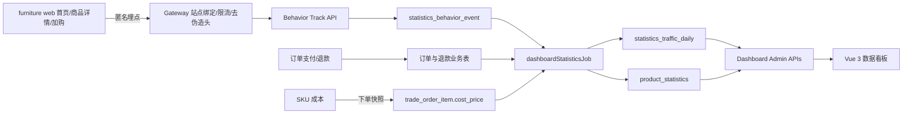

# 家具电商数据看板开发设计

> 状态：待业务评审（工程、安全与验收口径已补齐，评审通过后方可开发）
> 日期：2026-07-10
> 适用项目：`furniture web` 家具前台、`yudao-cloud` 后端、`yudao-ui-admin-vue3` 管理后台

## 1. 文档目的

本文档定义一期“数据看板”的业务口径、用户体验、埋点规则、数据模型、后端接口、前端页面、权限、异常处理、测试与验收标准。

实施目标是在现有管理后台新增一个独立一级导航“数据看板”，用于持续查看家具前台站点访问、商品访问、订单转化、销售额、成本和毛利等核心电商指标。

### 1.1 配套文档与变更控制

| 文档 | 唯一负责内容 |
|---|---|
| 本总体设计 | 业务范围、指标口径、运营体验、安全原则和验收目标 |
| `2026-07-10-furniture-dashboard-api-tracking-contract.md` | 请求/响应字段、状态码、权限和埋点协议 |
| `2026-07-10-furniture-dashboard-database-migration.md` | 表结构、索引、迁移、回填、保留和重算规则 |
| `2026-07-10-furniture-commerce-data-dashboard-implementation.md` | 按测试先行组织的代码任务、文件和执行顺序 |
| `2026-07-10-furniture-dashboard-test-acceptance.md` | 固定数据集、自动化、人工验收和发布门禁 |
| `2026-07-10-furniture-dashboard-release-rollback-runbook.md` | 环境配置、发布、监控、降级、回滚和证据留存 |

- 业务定义冲突时以总体设计为准；字段以 API/数据库专项文档为准；能否上线以测试验收和发布门禁中更严格的一项为准。发现冲突必须先修文档，禁止开发者自行选择口径。
- 指标公式、日期归属、筛选范围、权限、保留期或字段发生变化时，必须在同一个变更中同步更新受影响的设计、协议、迁移、计划、测试和发布文档，并记录评审人。
- 开发启动前必须由产品/运营确认范围与文案，由财务确认销售、退款、成本和币种口径，由安全/运维确认租户绑定、密钥、权限、日志、保留和回滚边界；未确认项不能通过“代码先做再说”隐式定案。
- 每项实现任务都必须能追溯到本设计章节和验收用例；没有验收用例的新增行为不进入一期，没有对应实现任务的验收项不得标记完成。

## 2. 现状和已知缺口

### 2.1 现有能力

- 芋道已有商品统计、交易统计、会员统计、排行榜、对比分析和 Excel 导出能力。
- `yudao-server` 已聚合 `yudao-module-statistics-server`，可在当前家具电商部署模式中继续扩展。
- 商品详情接口每次成功请求会累加 `product_spu.browse_count`。
- 已有 `product_statistics` 日统计，包含浏览、访客、收藏、加购、下单、支付、退款和转化率字段。
- 商品 SPU 和 SKU 已有成本价字段。

### 2.2 必须修复的缺口

- 当前没有独立的“数据看板”导航和聚合页面。
- 首页 `/` 没有独立访问埋点，无法准确统计首页 PV、UV 和趋势。
- 当前 `product_browse_history` 仅保存已登录用户，且同一用户对同一商品只保留最新一条，不能作为全量商品详情页 PV 数据源。
- 当前商品统计的转化率口径是“支付件数 ÷ 去重登录访客数”，与本项目需要的“支付订单数 ÷ 商品详情 PV”不一致。
- `trade_order_item` 没有保存下单当时的成本价，商品成本价后续变更会导致历史毛利失真。
- 现有统计任务以“昨日批处理”为主，不能满足看板当日数据的时效性。

## 3. 实现路线对比

### 3.1 方案 A：扩展现有芋道 Statistics 模块（推荐）

在 `yudao-module-statistics-server` 中新增访问事件、看板聚合、毛利统计和管理端接口；继续复用现有商品、订单、退款和权限体系。

优点：

- 与当前聚合部署、租户、权限、Excel 导出和 MyBatis 规范一致。
- 可复用现有 `product_statistics` 与商城统计前端组件。
- 不增加新服务的部署、注册中心、数据源和运维成本。

代价：

- 需要对现有商品统计口径做兼容扩展。
- 需要一次数据库迁移和历史数据回填。

### 3.2 方案 B：新建独立 Analytics 微服务

将埋点、访问事件、订单同步和看板查询全部拆到新服务。

优点：模块边界最清晰，便于未来接入消息队列、数据仓库和海量事件。

代价：当前业务规模下过度设计；需要新的部署、数据同步、权限和运维体系，一期成本最高。

### 3.3 方案 C：仅接入第三方网站分析

使用 Google Analytics、Plausible 或同类平台完成 PV、UV 和页面访问分析，后台只展示或跳转第三方报表。

优点：网站流量埋点快，有现成的来源、设备和地域分析。

代价：难以与芋道订单、成本、退款和商品权限做可靠联表；存在外部依赖、隐私合规和数据归属问题。

### 3.4 选型结论

一期采用方案 A。数据模型保留原始事件和日聚合层，以便业务量增长后再向独立分析服务平滑迁移。

## 4. 一期范围

### 4.1 必须实现

- 独立一级导航“数据看板”。
- 首页 PV、UV 及按日趋势。
- 商品详情页 PV、UV 及按日趋势。
- 支付订单数、支付件数、净销售额、退款额。
- 商品成本快照、毛利额、毛利率。
- 站点转化率和商品转化率。
- 加购率、客单价、退款率等常规辅助指标。
- 最近 7 天、30 天、90 天及自定义日期范围。
- 按商品和商品分类筛选。
- 当前区间与等长上一区间的环比。
- 商品表现排行榜、排序、分页和 Excel 导出。
- 数据更新时间、统计延迟和历史毛利估算标识。
- “全站经营”和“商品分析”两个互斥数据范围，禁止把全站首页流量伪装成商品筛选结果。
- 数据覆盖、缺失、部分、过期状态；流量缺口不得自动补成业务 0。
- 运营关注项：高流量低转化、高退款、负毛利和成本缺失，支持一键定位商品。
- 流量、销售、利润和导出分级权限，成本及毛利不默认暴露给普通运营角色。
- 仅对配置启用的家具租户开放，默认启用租户为当前家具业务租户 `121`。

### 4.2 一期不实现

- 秒级实时大屏。
- 广告渠道 ROI、UTM 归因、首次/末次触点归因。
- 跨设备用户身份合并。
- 用户热力图、会话录屏和 A/B 测试。
- 包含税费、支付手续费、人工、仓储和分摊运费的会计净利润。
- 拖拽式报表或大屏设计器。
- 第三方分析平台数据回传。
- 同一会话/同一访客 cohort 的完整归因漏斗；一期只展示独立去重的“阶段规模”。
- 同比、营销渠道归因和机器学习异常预测。

## 5. 用户和使用场景

### 5.1 目标用户

- 电商运营：关注访问、加购、订单、转化和商品排行。
- 商品管理：关注单品流量、销售、退款、毛利和异常。
- 财务或管理者：关注净销售额、成本、毛利、毛利率和数据口径。

### 5.2 核心使用场景

1. 运营人员进入“数据看板”，默认看到截至昨日的最近 30 个完整自然日，以及相比前一等长周期的变化。
2. 运营人员切换今日、昨日、7/30/90 天或自定义日期；“今日”明确显示未完成数据，不与完整日直接比较。
3. 运营人员切换到“商品分析”范围后，按分类或商品查看详情访问、订单、收入、毛利和转化；首页指标不参与商品筛选。
4. 商品管理通过排行表定位“高流量低转化”、“高销售低毛利”和“高退款”商品。
5. 管理者导出当前筛选条件下的商品表现明细。

## 6. 指标口径

所有时间口径使用 `Asia/Shanghai`。管理接口使用包含首尾的自然日参数 `startDate`、`endDate`；后端转换为起始日 `00:00:00` 到结束日次日 `00:00:00` 的左闭右开区间。浏览器处于其他时区时不得改变统计边界。

| 指标 | 一期口径 |
|---|---|
| 首页 PV | 路径精确为 `/` 的成功页面进入次数。首次加载、内部导航返回首页、用户主动刷新各计 1 次。 |
| 首页 UV | 按自然日对访客标识去重。已登录用户关联用户编号，未登录用户使用匿名访客标识。 |
| 商品详情 PV | 商品详情 `/product?id={spuId}` 数据加载成功后计 1 次。无效商品、加载失败和纯 API 重试不计入。 |
| 商品详情 UV | 按“自然日 + 商品 + 访客标识”去重。 |
| 加购次数 | 商品成功加入购物车后计 1 次；接口失败或本地预览回退不计入真实加购。 |
| 加购率 | 有成功加购的访客数 ÷ 商品详情 UV × 100%。 |
| 支付订单数 | `trade_order.pay_time` 落在统计区间内的去重支付订单数。取消和未支付订单不计入。 |
| 支付件数 | 支付成功订单的商品数量之和。 |
| 站点 PV 转化率 | 支付订单数 ÷ 首页 PV × 100%。此口径与本期业务需求保持一致。 |
| 站点 UV 转化率 | 支付买家数 ÷ 首页 UV × 100%，作为辅助指标展示。 |
| 商品转化率 | 包含该商品的支付订单数 ÷ 该商品详情 PV × 100%。分子按订单去重，不使用商品件数。 |
| 商品 UV 转化率 | 购买该商品的去重买家数 ÷ 该商品详情 UV × 100%，作为辅助指标。 |
| 支付销售额 | 支付订单商品明细 `pay_price` 之和。不包含订单税费和额外运费。 |
| 退款额 | `trade_after_sale.refund_time` 落在统计区间内的成功退款金额之和，归属退款成功日，不回写原支付日。 |
| 净销售额 | 支付销售额 - 退款额。 |
| 成本金额 | 已支付且未成功退回库存的净销售件数 × 订单明细的下单成本快照。 |
| 商品毛利 | 净销售额 - 成本金额。 |
| 商品毛利率 | 商品毛利 ÷ 净销售额 × 100%。净销售额小于等于 0 时返回空值并说明“当前口径下毛利率无意义”。 |
| 支付客单价 | 支付销售额 ÷ 支付订单数，按币种最小单位四舍五入。退款按成功日另行体现，避免跨期退款把当期客单价扭曲为负数。 |
| 退款率 | 退款额 ÷ 支付销售额 × 100%。退款按成功日归属，因此跨期退款可能使当期退款率超过 100%、净销售额为负，页面不得强制截断。 |
| 周期对比 | 当前完整自然日区间与紧邻之前的等长区间对比。计数和金额显示绝对变化及相对百分比；转化率、毛利率、退款率显示百分点变化。对比值为 0 时显示“无可比数据”。 |

### 6.1 数据范围与可解释性

- `SITE`（全站经营）：展示首页 PV/UV、全站商品详情 PV/UV、订单、收入、阶段规模和站点转化率；不接受 `categoryId`、`spuId`。
- `PRODUCT`（商品分析）：允许分类或单个 SPU 筛选，只展示商品详情及其加购、订单、收入、利润和商品转化；首页 PV/UV、站点转化率隐藏并标注“首页流量无法按商品归因”。
- 分类筛选约束商品候选；切换分类时若当前商品不属于新分类，前端清空商品并提示，不允许 `spuId` 静默覆盖 `categoryId`。
- 站点和商品转化率均为“同一时间区间的规模比”，不是同一访客或同一会话归因，可能受跨期浏览、直接访问和跨设备购买影响。页面口径提示必须明确写出，数值不得作为广告归因依据。
- 由于订单可能来自区间前访问、直接访问或其他设备，上述规模比在极端情况下可以超过 100%；接口和页面保留真实结果并提示口径，不得强制截断为 100%。
- 商品详情 UV 按商品去重，因此各商品 UV 求和可能大于全站商品详情 UV；商品支付订单数求和也可能大于站点订单数，因为一张订单可包含多个 SPU。
- 一期分类筛选使用商品当前分类，库存和上架状态也使用查询时当前值，不保存历史分类/库存/状态快照。商品改类后历史日指标会随当前分类筛选归组，页面将相关字段标注为“当前”。

### 6.2 数据覆盖与可信度

- 流量埋点上线前的数据不可回填。接口以 `trafficDataAvailableFrom` 和 `trafficDataStatus=COMPLETE|PARTIAL|UNAVAILABLE` 表达覆盖范围，另以 `freshnessStatus=FRESH|DELAYED|STALE` 表达数据是否及时；两者不得混为一个状态。
- 请求区间包含埋点启用前或缺失日期时，PV/UV 对应日期返回空值而不是 0，站点/商品转化率返回空值并显示“流量覆盖不完整”。
- 当前自然日固定为 `PARTIAL`；默认最近 30 天不包含今日。选择“今日”时显示“截至 HH:mm”，一期不默认提供周期比较。
- 财务指标以支付、订单、售后和成本快照为权威来源；客户端流量与加购指标只用于运营方向判断，不作为计费、结算或审计依据。
- 每个接口返回自己的 `asOf`、`lastSuccessfulRunAt` 和分源水位。页面页头使用最早水位作为整页“数据截至”时间；不能用某个成功接口替代全页新鲜度。

| 指标域 | 权威数据源 | 默认问题责任角色 | 使用边界 |
|---|---|---|---|
| 首页/商品流量 | `statistics_behavior_event` 及流量日聚合 | 前台与数据工程 | 运营趋势，不作财务结算 |
| 支付订单/销售额 | `trade_order.pay_time` 与订单明细 | 交易服务负责人 | 财务对账前仍以交易原单为准 |
| 退款 | `trade_after_sale.refund_time` 的成功售后 | 售后/交易负责人 | 按退款成功日归属，不回写支付日 |
| 成本/毛利 | `trade_order_item.cost_price` 下单快照与退货成本冲回 | 财务口径负责人 | 商品毛利，不等于会计净利润 |
| 当前库存/上架状态 | 商品与库存服务当前值 | 商品运营 | 只用于操作定位，不代表历史日快照 |

对账异常先按表中权威源定位，不得直接手工修改日聚合结果；修复源数据或规则后通过受审计的重算任务恢复。

### 6.3 退款与成本的特殊规则

- 退货并恢复库存：减少净销售额，同时减少对应返回商品的成本。
- 仅退款不退货：减少净销售额，不减少成本。
- 部分退款：按成功退款金额减少净销售额；仅在有明确退货件数时减少对应成本。
- 未支付、支付关闭或退款未成功状态不影响净销售额和毛利。
- 退货成本冲回以 `AfterSaleWayEnum.RETURN_AND_REFUND`、售后完成状态和退货数量为准；仅退款不得触发库存恢复。当前交易服务对成功售后统一恢复库存的逻辑必须在本功能上线前同步修正并回归测试。
- 只要区间内存在一条缺失成本的订单明细，`costAmount`、`grossProfit`、`grossMarginPercent` 均返回空值，不得用已知成本计算出貌似完整的毛利。
- 区间内没有支付成本入账或退货成本冲回记录时，利润质量为 `NOT_APPLICABLE`；只有仅退款时成本为 0、毛利可为负，但毛利率因净销售额不大于 0 返回空。估算成本显示“约”，不得与精确值使用相同视觉语义。

## 7. 埋点设计

### 7.1 事件类型

| 事件 | 触发时机 | 关键维度 |
|---|---|---|
| `HOME_VIEW` | 首页首次渲染或 SPA 导航进入 `/` | 访客、会话、路径、来源 |
| `PRODUCT_DETAIL_VIEW` | 商品详情数据加载成功 | 访客、会话、SPU、路径、来源 |
| `ADD_TO_CART` | 真实购物车写入事务提交后，由 Trade 服务异步记录 | 已登录用户、可选访客/会话、SPU、SKU、数量 |
| `CHECKOUT_START` | 用户从购物车进入真实结算流程 | 访客、会话、购物车商品数 |

支付成功不依赖前端埋点，必须以后端订单支付状态为准，防止前端事件丢失或重复导致财务指标错误。

### 7.2 访客与会话

- 分析同意策略关闭时，前台首次访问生成 UUID 作为 `visitorId`，连同创建时间保存在 `localStorage`；策略开启时，必须在用户同意后才创建和持久化。访客标识最长 180 天后轮换，保留期缩短时随配置缩短，不得无限期持久化。
- `sessionId` 与 `lastActiveAt` 保存在 `sessionStorage`。页面产生白名单业务事件时更新活动时间；连续 30 分钟无业务事件后生成新会话，不能简单等同于“浏览器标签页生命周期”。
- 已登录用户由后端从访问令牌解析 `userId`，后端不接受前端传入的用户编号。
- 后端使用 HMAC-SHA256 对 `visitorId` 和 `sessionId` 摘要后存储，不保存原始标识；事件同时保存 `hash_key_version`，支持密钥轮换。
- 生产环境没有 HMAC 主密钥时服务必须拒绝启动，不提供默认密钥。密钥轮换只在 `Asia/Shanghai` 自然日边界生效，同一租户同一自然日不得混用版本，避免同日 UV 双计；旧密钥保留到对应原始事件完成删除/删除请求处理后再销毁。
- 用户撤回分析同意时立即停止上报并清除本地 `visitorId`、`sessionId`；会员或访客删除请求按隐私流程物理删除保留期内的原始事件，已完成且不可回溯到个人的日聚合继续保留。

### 7.3 重复事件和刷量控制

- 每个事件生成全局唯一 `eventId`，后端执行普通插入并仅捕获 `(tenant_id, event_id)` 的 `DuplicateKeyException` 作为幂等成功；其他数据库异常必须失败并计入监控。
- 服务端按“租户 + 访客摘要 + 事件类型 + 标准化路径 + SPU + SKU”计算复合键，同一键在 5 秒内只计 1 条，用于消除组件重复挂载和网络重试；客户端去重仅作优化，不能替代服务端规则。用户主动刷新且超过 5 秒时仍计为新 PV。
- 公共 5 秒窗口使用 Redis 原子写入和 TTL；去重存储不可用时拒绝公共事件、告警并标记流量覆盖缺口，不得为追求可用性绕过去重写入。该失败仍由前台静默隔离，不影响购物主链路。
- 使用专用限流键解析器，只取“服务端绑定的租户 + 可信代理解析后的客户端 IP”，不得把 `eventId` 或请求体参数放入限流键。默认单 IP 120 次/分钟、单访客 120 次/分钟、单租户 6000 次/分钟，并配置全局熔断阈值。
- 请求体最大 8 KB；`visitorId`、`sessionId`、`eventId` 最大 64 字符，`pagePath` 最大 255 字符，`quantity` 为 1 至 999 的整数。
- 过滤常见搜索引擎、监控器和自动化测试 User-Agent；内部 CIDR、带服务端签名测试标记和异常高频访问分别标记质量原因。原始事件保留 `traffic_quality`/`exclusion_reason`，被排除事件不进入业务指标但计入质量监控。

### 7.4 上报策略

- 前端新增独立 `analytics` 服务，不在页面组件内散落拼接请求。
- 统一复用家具前台 `requestYudao` 并设置 `keepalive: true`，以保留可选会员令牌；不使用无法设置必要请求头的 `navigator.sendBeacon`。
- 埋点固定经网关精确路由 `POST /app-api/statistics/behavior/track` 进入 Statistics 服务，服务本身不得直接暴露公网；不得为方便而暴露整个 `/app-api/statistics/**`。网关按受控的站点 Host/Origin 映射到启用租户并覆盖外部 `tenant-id`；请求携带会员令牌时，令牌租户必须与站点映射租户一致。匿名请求不得自行选择租户。
- CORS 只允许配置中的精确家具前台 Origin，浏览器请求拒绝 `Origin: null`；网关移除外部伪造的内部用户头。若未来改用 Cookie 鉴权，须在发布前另加 CSRF 防护，本期保持 Bearer Token。
- 埋点失败不阻止页面展示、加购或结算，不向普通用户弹出错误提示。
- 事件上报超时设为 2 秒，最多重试 1 次，重试复用原 `eventId`。
- 浏览器只上报标准化路径和 `referrerHost`，不发送完整 Referrer、客户端设备类型或业务发生时间；`occurred_at` 统一使用服务端接收时间，设备类型由服务端根据截断后的 User-Agent 分类后立即丢弃原文。
- 公共追踪接口不接受 `ADD_TO_CART`。家具前台只在追踪总开关开启且满足分析同意策略后，才在真实购物车请求中附带分析身份头；Trade 在购物车事务成功提交后按服务端站点同意配置决定是否生成事件并异步调用 Statistics，失败只计监控、不回滚加购。`consentRequired=true` 且缺少同意后身份时不生成事件；原始身份头不得进入访问日志。

## 8. 数据模型

### 8.1 原始行为事件表 `statistics_behavior_event`

| 字段 | 类型要求 | 说明 |
|---|---|---|
| `id` | bigint | 主键 |
| `tenant_id` | bigint | 租户编号 |
| `event_id` | varchar(64) | 事件生产方生成的唯一标识，唯一索引 |
| `event_type` | tinyint | 首页访问、商品详情访问、加购、开始结算 |
| `event_source` | tinyint | `PUBLIC_WEB` / `SERVER_CART`，用于区分信任来源 |
| `visitor_hash` | char(64) | 匿名访客哈希 |
| `session_hash` | char(64) nullable | 会话哈希；无客户端分析身份的服务端加购可空 |
| `hash_key_version` | smallint | HMAC 密钥版本 |
| `user_id` | bigint nullable | 已登录会员编号 |
| `spu_id` | bigint nullable | 商品 SPU 编号 |
| `sku_id` | bigint nullable | 商品 SKU 编号 |
| `quantity` | int nullable | 加购数量 |
| `page_path` | varchar(255) | 标准化页面路径，不保存敏感查询参数 |
| `referrer_host` | varchar(255) nullable | 来源域名，不保存完整来源 URL |
| `device_type` | tinyint | 服务端分类的 desktop / mobile / tablet / other |
| `traffic_quality` | tinyint | accepted / bot / internal / test / rate_excluded |
| `exclusion_reason` | varchar(64) nullable | 排除原因代码，不记录敏感原文 |
| `occurred_at` | datetime | 服务端接收时间，按 `Asia/Shanghai` 归属自然日 |
| `create_time` | datetime | 服务器入库时间 |

索引：

- 唯一索引 `(tenant_id, event_id)`。
- 查询索引 `(tenant_id, event_type, occurred_at)`。
- 商品查询索引 `(tenant_id, spu_id, event_type, occurred_at)`。
- UV 聚合索引 `(tenant_id, occurred_at, visitor_hash)`。

### 8.2 站点日聚合表 `statistics_traffic_daily`

| 字段 | 说明 |
|---|---|
| `tenant_id`, `day` | 唯一键 |
| `home_pv`, `home_uv` | 首页 PV / UV |
| `product_detail_pv`, `product_detail_uv` | 全站商品详情 PV / UV |
| `add_cart_count`, `add_cart_user_count` | 加购次数 / 加购访客数 |
| `checkout_start_count` | 开始结算会话数，按 `session_hash` 去重 |
| `paid_order_count`, `paid_buyer_count` | 支付订单数 / 支付买家数 |
| `paid_item_count` | 支付件数 |
| `paid_revenue` | 支付销售额，单位：币种最小单位（USD 为 cent） |
| `refund_amount` | 成功退款额，单位：币种最小单位 |
| `net_revenue` | 净销售额，单位：币种最小单位 |
| `cost_amount` | 成本金额，单位：币种最小单位 |
| `gross_profit` | 商品毛利，单位：币种最小单位 |
| `exact_cost_item_count`, `estimated_cost_item_count`, `missing_cost_item_count` | 精确、估算、缺失的成本移动行数；支付成本入账和退货成本冲回均按发生日计 |
| `known_cost_amount` | 已知成本合计，仅用于解释覆盖率，不用于伪造完整毛利 |
| `accepted_event_count`, `excluded_event_count` | 纳入/排除的行为事件数 |
| `traffic_data_status` | 覆盖状态：`COMPLETE` / `PARTIAL` / `UNAVAILABLE`；新鲜度由水位和成功时间动态计算 |
| `traffic_watermark`, `trade_watermark`, `refund_watermark` | 分源数据水位 |
| `update_time` | 最后聚合时间 |

金额列统一使用 `bigint`/Java `Long`，避免累计金额溢出。`cost_amount`、`gross_profit` 在存在缺失成本时为 `NULL`，不能设置为非空默认 0。

### 8.3 复用并扩展 `product_statistics`

保留现有字段，但将 `browse_count` 和 `browse_user_count` 的数据源改为 `PRODUCT_DETAIL_VIEW` 原始事件。新增：

- `paid_order_count`：包含该商品的去重支付订单数。
- `paid_buyer_count`：购买该商品的去重用户数。
- `cost_amount`：商品净销售成本。
- `gross_profit`：商品毛利。
- `gross_margin_percent`：商品毛利率。
- `exact_cost_item_count`、`estimated_cost_item_count`、`missing_cost_item_count`：成本移动覆盖行数；同一订单明细可在支付日和后续退货日分别参与一次。
- `known_cost_amount`：已知成本合计。
- `traffic_data_status`、`traffic_watermark`：商品流量覆盖和水位。

上述金额字段迁移为 `bigint`/Java `Long`；存在缺失成本时商品 `cost_amount`、`gross_profit`、`gross_margin_percent` 均为 `NULL`。

现有 `order_pay_count` 继续表示支付件数，不改名，避免破坏旧接口；新增 `paid_order_count` 专门用于订单转化率。

`product_spu.browse_count` 作为现有商品累计浏览数继续保留，不作为看板日统计数据源。看板 PV/UV 仅来自 `statistics_behavior_event`，避免与现有详情接口的累加逻辑发生双重计数。

### 8.4 订单成本快照

`trade_order_item` 新增：

- `cost_price` bigint nullable：下单时对应 SKU 的单件成本价，单位为币种最小单位。
- `cost_estimated` bit not null default 0：是否为历史回填估算成本。

新订单创建时必须从 SKU 数据快照成本价，不允许在看板查询时直接使用商品当前成本价代替。

历史订单迁移规则：

1. 按订单明细的 SKU 查询当前成本价回填 `cost_price`。
2. 回填成功的历史记录设置 `cost_estimated = 1`。
3. SKU 已删除且无法找到成本时，`cost_price` 保持空；看板将该时间范围标记为“成本数据不完整”，不将空成本当作 0。

## 9. 聚合和数据时效

### 9.1 聚合任务

新增 `dashboardStatisticsJob`，按租户执行：

- 仅遍历配置中明确启用的租户；默认家具租户为 `121`，不对全部租户自动开启采集或聚合。
- 每 5 分钟重算今日和昨日，保证看板延迟不超过 10 分钟并吸收跨午夜迟到事件。
- 每日 `00:10` 最终重算昨日数据。
- 每日低峰期滚动修复最近 7 天，吸收迟到支付和售后；支持受权限和天数上限保护的显式历史重算，用于回填和故障恢复。
- 采用按日删除后重算或唯一键 upsert，不允许因“数据已存在”跳过迟到订单、退款或埋点。
- 销售额、支付订单和下单成本按 `trade_order.pay_time` 归日；退款额与退货成本冲回按 `trade_after_sale.refund_time` 归日。所有订单、明细、商品、分类和售后连接必须同时约束相同 `tenant_id` 与 `deleted = 0`。

### 9.2 原始数据保留

- 原始行为事件保留 180 天。
- 日聚合数据长期保留。
- 每日执行物理清理任务，仅删除超过保留期、聚合水位已越过且校验完成的原始事件；租户停用或删除时停止采集与任务并按租户数据生命周期完成清理和密钥销毁。

### 9.3 数据质量标识

看板接口返回 `profitDataQuality`：

- `EXACT`：选定区间的成本均来自下单快照。
- `MIXED`：同时包含快照成本和历史估算成本。
- `ESTIMATED`：选定区间仅包含历史估算成本。
- `INCOMPLETE`：存在无法回填成本的订单明细。
- `NOT_APPLICABLE`：选定区间没有需要评估成本完整性的支付成本入账或退货成本冲回记录。

接口同时返回三类成本行数、`knownCostAmount` 和 `costCoveragePercent`。页面必须解释 `MIXED`/`ESTIMATED`/`INCOMPLETE`；`INCOMPLETE` 时利润值为空，不得将估算或部分已知毛利伪装为完整财务数据。

`costCoveragePercent = (exactCostItemCount + estimatedCostItemCount) ÷ 三类成本移动总数 × 100%`；没有成本移动时返回空而不是 100%。它表示行覆盖率，不代表金额覆盖率或估算准确度。

## 10. 后端接口

### 10.1 前台埋点接口

`POST /app-api/statistics/behavior/track`

请求字段：

```json
{
  "eventId": "uuid",
  "eventType": "HOME_VIEW",
  "visitorId": "anonymous-uuid",
  "sessionId": "session-uuid",
  "spuId": null,
  "skuId": null,
  "quantity": null,
  "pagePath": "/",
  "referrerHost": "example.com"
}
```

接口规则：

- 允许匿名访问，有访问令牌时关联会员；租户只能来自网关维护的站点映射，不能信任匿名客户端传入的 `tenant-id`。
- 仅接受白名单事件类型。
- 公共接口只接受 `HOME_VIEW`、`PRODUCT_DETAIL_VIEW`、`CHECKOUT_START`；`PRODUCT_DETAIL_VIEW` 必须包含当前映射租户下、未删除且有效的 `spuId`。公共 `ADD_TO_CART` 一律拒绝，服务端购物车事件另走内网 API，并校验 SKU 属于 SPU 和同一租户。
- 执行长度、枚举、路径、数量、来源域、站点 Origin、限流、5 秒去重和流量质量校验；追踪失败不反向影响商品页业务接口。
- 成功接收或幂等重复时均返回成功。
- 接口访问日志、异常日志和限流日志不得记录请求体、原始访客/会话 UUID、令牌、完整 IP 或完整 User-Agent；只记录追踪编号、租户、结果码和聚合后的安全指标。

### 10.2 看板汇总

`GET /admin-api/statistics/dashboard/summary`

查询参数：

- `scope=SITE|PRODUCT`：必填，决定可用指标和筛选项。
- `startDate`, `endDate`：必填，包含首尾的家具业务时区自然日，最大时间跨度 366 天。
- `compare=true|false`：可选；今日等不完整区间默认关闭。
- `categoryId`、`spuId`：仅 `PRODUCT` 可选；两者同时出现时商品必须属于分类，否则返回参数错误，不允许静默覆盖。

返回 `DataComparisonRespVO<DashboardSummaryRespVO>`，包含：

- 首页 PV/UV、商品详情 PV/UV。
- 加购次数、支付订单数、支付件数。
- 支付销售额、退款额、净销售额、成本、毛利、毛利率。
- PV 转化率、UV 转化率、加购率、客单价、退款率。
- `profitDataQuality`、精确/估算/缺失成本行数、成本覆盖率。
- `currencyCode`、`timezone`、`trafficDataStatus`、`freshnessStatus`、`trafficDataAvailableFrom`、`asOf`、分源水位和 `lastSuccessfulRunAt`。
- 率类对比返回 `changePercentagePoints`，计数和金额对比返回 `changeAmount`/`changePercent`；基准为 0 时不返回伪造的百分比。

### 10.3 看板趋势

`GET /admin-api/statistics/dashboard/trend`

查询参数同汇总接口，另包含 `granularity=DAY`。一期只支持日粒度。

每日返回：

- `day`
- `homePv`, `homeUv`
- `productDetailPv`, `productDetailUv`
- `paidOrderCount`
- `netRevenue`
- `grossProfit`
- `siteConversionPercent`
- `trafficDataStatus`, `profitDataQuality`, `asOf`

已确认采集正常但业务活动为零的日期补 0；埋点启用前、采集缺失或数据过期的日期返回空值和状态，ECharts 使用断点而不是把未知值画成 0。

### 10.4 阶段规模

`GET /admin-api/statistics/dashboard/stage-overview`

`SITE` 返回首页 UV、全站商品详情 UV、加购访客数、开始结算会话数和支付买家数；`PRODUCT` 只返回筛选范围内的商品详情 UV、加购访客数和支付买家数，首页与没有商品维度的结算阶段标为 `NOT_APPLICABLE`。每一项同时返回 `unit`、`dedupeScope`、`applicability`，整体返回 `cohortAligned=false` 和口径说明。由于这些数值分别按自然日访客、会话和买家去重，一期不得命名为归因漏斗、不得计算“最大流失环节”，也不得暗示同一批用户逐层转化。

### 10.5 运营关注项

`GET /admin-api/statistics/dashboard/attention`

返回可解释的规则型关注项及命中商品：

- 高流量低转化：详情 PV 不低于 100 且商品 PV 转化率低于 1%。
- 高退款：支付订单数不低于 10、支付销售额不低于当前租户配置门槛且退款率高于 10%。
- 低/负毛利：利润数据非 `INCOMPLETE`，且毛利小于 0，或在支付订单数不低于 5 时毛利率低于 10%。
- 成本缺失：`missingCostItemCount > 0`。

阈值必须来自租户级配置并随响应返回，页面明确标注“规则提示，不代表自动诊断”；关注项支持一键切换 `riskType` 并定位商品表。无权限查看利润时不返回毛利和成本类关注项。

规则依赖的数据不完整时不得把“无法评估”显示成“0 个异常”：流量覆盖不完整时不评估高流量低转化，利润为 `INCOMPLETE` 时不评估低毛利但仍可提示成本缺失。接口以 `notEvaluated` 返回未评估规则和受控原因码；只有所有有权限规则均已评估且无命中时，页面才显示“当前规则下未发现关注项”。

### 10.6 商品表现分页

`GET /admin-api/statistics/dashboard/product-page`

支持：

- 日期、分类、商品名称/编码。
- `riskType`：高流量低转化、高退款、低/负毛利、成本缺失。
- 分页和按 PV、UV、支付订单、净销售额、毛利、毛利率、转化率、退款率排序；排序字段使用后端白名单映射，SQL 禁止拼接客户端原始字段。

列字段：

- SPU 编号、商品图、商品名称、分类。
- 详情 PV/UV、加购访客数。
- 支付订单数、支付件数。
- 净销售额；具备利润权限时返回成本、毛利、毛利率。
- 商品转化率、退款率。
- 上架状态、可售库存、关键指标相比上一周期的变化。
- 毛利数据质量、精确/估算/缺失成本行数和流量覆盖状态。

### 10.7 导出

`GET /admin-api/statistics/dashboard/export-product-excel`

导出必须严格复用当前页面筛选和排序条件，金额按响应 `currencyCode` 的主单位显示，原始存储和接口传输仍使用最小货币单位。本家具站默认 `USD`，上线前必须与结算/支付币种配置核对一致。

普通导出不包含成本和毛利；利润导出另需 `statistics:dashboard:profit-export`。单次最多 10,000 行、单用户每 10 分钟最多 3 次，超过时提示缩小范围。所有文本单元格对 `=`、`+`、`-`、`@`、制表符和回车开头做公式注入转义；审计记录操作人、租户、筛选摘要、行数、文件哈希、追踪编号和结果，不记录导出内容。

## 11. 导航和权限

### 11.1 菜单

- 名称：数据看板
- 层级：一级菜单，直接打开看板，一期不再增加无意义的二级目录。
- 路径：`/dashboard`
- 组件：`dashboard/index`
- 组件名：`FurnitureDashboard`
- 图标：`ep:data-analysis`
- 基础查询权限：`statistics:dashboard:query`
- 成本/利润查看权限：`statistics:dashboard:profit-query`
- 导出权限：`statistics:dashboard:export`
- 利润导出权限：`statistics:dashboard:profit-export`

菜单记录通过幂等 SQL 迁移新增，按 `path=/dashboard` 判断是否已存在，不在本规格中硬编码可能与环境冲突的菜单主键。

### 11.2 Furniture Lite

当前前端启用 `furniture-lite`，必须将 `/dashboard` 加入 `allowedMenuPaths`，否则后端菜单创建成功后仍会被前端过滤。

### 11.3 角色

- 管理员默认获得全部权限；角色授权仍须遵守最小权限原则并留下变更审计。
- 运营角色默认仅获得基础查询权限，可查看流量、订单、收入和退款，不默认查看成本与毛利。
- 财务/经营管理角色经审批后获得利润查询权限；所有导出权限单独控制，不因可查看页面或利润而自动开放。
- 前端隐藏无权限字段只是体验措施，后端 VO 必须在序列化前剔除利润字段；汇总、趋势、关注项、商品分页和导出接口均独立鉴权。
- 所有查询必须保留芋道租户隔离，不允许跨租户聚合。

## 12. 管理端页面设计

### 12.1 视觉参考

参考 [shadcn/ui `dashboard-01`](https://ui.shadcn.com/view/new-york-v4/dashboard-01) 的内容布局和视觉层级，不直接执行 `npx shadcn@latest add dashboard-01`。

原因：参考块使用 React、Tailwind CSS 和 shadcn/Radix 组件，当前管理端使用 Vue 3、Element Plus、UnoCSS 和 ECharts。直接安装会引入不兼容的运行时和重复设计系统。

改写原则：

- 保留芋道现有左侧导航、顶部栏、面包屑和页签系统。
- 仅将 `dashboard-01` 的看板内容区转换为 Vue/Element Plus 实现。
- 使用低饱和黑白灰、1px 边框、8至 12px 圆角、轻或无阴影、紧凑但有呼吸感的间距。
- 颜色继续使用当前 `furniture-admin.scss` 的中性色变量，不新建另一套主题。
- 颜色表达由指标语义决定：收入、订单、转化和毛利上涨通常为正向，退款率上涨为负向；颜色必须同时配合图标、文字和正负号，不能只靠红绿区分。估算/不完整数据使用黄褐色提示。

### 12.2 组件映射

| shadcn 概念 | 当前项目实现 |
|---|---|
| Card | `el-card` + 项目定制边框样式 |
| Toggle Group | `el-segmented` |
| Date Range | `el-date-picker` daterange |
| Select | `el-select` |
| Data Table | `el-table` + `Pagination` |
| Badge | `el-tag` |
| Area/Line Chart | 现有 `Echart` 组件 + ECharts |
| Icons | 现有 `Icon` + Element Plus/Iconify 图标 |
| Skeleton | `el-skeleton` |

### 12.3 页面结构

1. **页头**
   - 标题“数据看板”。
   - 副标题“访问、转化与商品盈利表现”。
   - 展示业务时区、币种、“数据截至 HH:mm”和流量/交易分源水位；过期或部分数据用非阻塞提示说明影响范围。
   - 右侧放置刷新和导出操作。

2. **全局筛选栏**
   - 最左侧固定为 `全站经营` / `商品分析` 分段切换；只有商品分析显示分类、商品筛选。
   - 今日 / 昨日 / 近 7 个完整日 / 近 30 个完整日 / 近 90 个完整日快捷切换，默认截至昨日的近 30 个完整自然日。
   - 自定义日期范围，最大 366 天。
   - 商品分类筛选。
   - 商品筛选，支持商品名称或 SPU 编号搜索。
   - 完整日区间“对比上一周期”默认开启；今日默认关闭并显示“未完整日”。
   - 已应用的 `scope`、日期、分类、商品、关注类型、排序和分页同步到 URL query，刷新/分享后可复现；筛选变化取消旧请求并通过请求序号丢弃迟到响应。

3. **四张主指标卡**
   - 净销售额。
   - 支付订单数。
   - 商品毛利（仅利润权限；无权限时替换为商品详情 PV）。
   - 站点 PV 转化率（`SITE`）或商品 PV 转化率（`PRODUCT`），标题直接注明“支付订单 ÷ 浏览量”。

   每张卡包含当前值、相比上一周期、趋势语义、一句简短解读和口径提示。毛利卡同时展示数据质量状态；缺失成本时显示“—”和缺失行数，不显示部分毛利。

4. **辅助指标条**
   - 首页 PV/UV、商品详情 PV/UV。
   - 加购率。
   - 支付客单价。
   - 退款率。

5. **运营关注项**
   - 以紧凑提示卡展示高流量低转化、高退款、低/负毛利和成本缺失的命中数量、规则阈值及建议动作。
   - `SITE` 页面按同一日期显示“全部商品关注”，不套用首页流量作为商品分母；`PRODUCT` 页面按当前分类/SPU 显示。该区块始终明确自己是商品规则范围。
   - 点击提示卡切换商品分析、应用对应 `riskType` 并滚动到商品表；全部规则已评估且没有命中时显示“当前规则下未发现关注项”，部分规则因数据质量未评估时显示原因而不是制造“安全”结论。
   - 无利润权限时不请求也不展示毛利和成本类提示。

6. **主趋势图**
   - `SITE` 默认展示“首页 PV”与“全站商品详情 PV”；`PRODUCT` 默认展示“商品详情 PV”与“支付订单数”，不显示无法按商品归因的首页流量。
   - 可切换“流量”、“订单”、“收入”、“毛利”和“转化”。
   - 鼠标悬浮或键盘聚焦显示当日值和相比上一周期；缺失日期断线并显示原因，真实 0 正常落在零轴。
   - 日期区间超过 90 天时仍保持日粒度，但自动降低 X 轴标签密度。

7. **路径阶段规模**
   - `SITE`：首页 UV → 商品详情 UV → 加购访客 → 开始结算 → 支付买家；`PRODUCT`：商品详情 UV → 加购访客 → 支付买家，不伪造商品级首页或结算数据。
   - 展示每一阶段数值、单位与去重范围，并固定提示“各阶段并非同一批用户，不构成归因漏斗”。一期不展示逐层转化率和“最大流失”。

8. **商品表现表**
   - 默认按商品详情 PV 倒序。
   - 默认固定左侧商品列和右侧操作列；默认展示商品、详情 PV、加购访客、支付订单、净销售额、商品转化率、退款率和相比上一周期。利润列仅按权限出现，可通过列设置展开库存、状态和质量明细。
   - 提供“高流量低转化”“高退款”“低/负毛利”“成本缺失”快捷视图；当前阈值始终可见并可一键清除。
   - 商品名称可点击打开现有后台商品详情；操作列按现有模块权限提供“查看商品”“相关订单”“相关售后”深链，并带上 SPU 与当前日期范围，任何深链目标仍由目标模块后端独立鉴权。
   - 支持分页、排序、空数据和导出。

### 12.4 响应式

- 大屏：主卡片 4 列，趋势图与阶段规模按 2:1 布局。
- 中屏：主卡片 2 列，趋势图和阶段规模纵向堆叠。
- 小屏：主卡片 1 列，筛选项折叠到“筛选”抽屉，商品表允许水平滚动。
- 1280px、1024px、768px 和 390px 均须支持浏览器 200% 缩放；固定列不能遮挡表格内容，操作入口可由键盘触达。

### 12.5 状态设计

- 初次加载：使用与最终布局一致的骨架屏，避免页面跳动。
- 局部刷新：保留原数据，仅在筛选栏和相关区块显示加载。
- 空数据：明确显示“当前条件下暂无数据”，不伪造 0 值趋势。
- 部分失败：指标卡、趋势图、阶段规模、关注项和表格独立显示重试，不因单个接口失败让整页不可用。
- 聚合过期：`lastUpdatedAt` 超过 10 分钟显示“数据更新延迟”，超过 20 分钟升级为醒目的“严重延迟”；页面继续显示上次成功数据和明确水位。
- 数据不可用：卡片显示“—”和原因，趋势保留日期轴但使用断点；不得把权限不足、接口失败、未采集或成本缺失显示成业务 0。

### 12.6 无障碍与可操作性

- 所有筛选项有可见标签；键盘可完成范围切换、日期选择、表格排序、分页、刷新、关注项定位和导出。
- ECharts 开启 `aria`，同时提供“查看数据表”入口；图例、线型、点型和文字共同区分序列，不以颜色作为唯一信号。
- 异步刷新状态使用 `aria-live="polite"`，失败重试后焦点保持在原区块；Tooltip 可通过键盘聚焦触发。
- 自动化可访问性检查无严重/高等级问题，并以键盘、200% 缩放和屏幕阅读器抽查作为验收证据。

## 13. 数据流



## 14. 异常处理和隐私

### 14.1 埋点故障

- 埋点接口异常不得影响前台购物流程。
- 后端指标监控接收、排除、失败、被限流、幂等重复和 5 秒重复事件数，按原因代码聚合但不以访客标识作为监控标签。
- 连续 15 分钟入库数为 0 但站点仍有正常请求时产生告警。

### 14.2 聚合故障

- 任务必须幂等，同一天可重复执行。
- 任务失败记录租户、日期和处理阶段，不记录原始访客标识。
- 看板保留上次成功聚合数据，并明示数据延迟，不因任务失败展示全 0。

### 14.3 隐私

- 不存储原始 IP、完整 Referrer URL、访问令牌、邮箱、手机号或完整 User-Agent。
- 匿名访客标识仅用于统计去重，不用于个人营销画像。
- 如目标部署地区要求分析同意，前台需在用户同意分析 Cookie/本地存储后才创建 `visitorId` 并上报；一期不实现无标识 cookieless 采集，未同意前不发送行为事件，并在流量口径说明中披露同意机制带来的覆盖偏差。
- 原始事件 180 天到期后物理删除；会员/访客删除、撤回同意和租户退场均有可执行流程与审计记录。日聚合不包含访客或会员标识，可按业务留存策略长期保留。

### 14.4 安全边界

- **租户边界**：外部匿名请求无权指定租户；网关按受控站点配置绑定租户。所有 DO 继承租户基类，查询、关联、更新、删除、聚合和导出均显式校验同租户，不使用 `TenantIgnore` 绕过。
- **网络边界**：公网只开放网关上的单一 `POST /app-api/statistics/behavior/track` 路由；Statistics 服务、管理接口、任务接口和数据库只在内网可达。网关为该精确路径配置独立路由、精确 Origin 白名单、请求体上限、限流和内部头清理。
- **身份边界**：管理接口使用现有登录认证；查询、利润查询、普通导出和利润导出分别鉴权。任务管理、历史回填和清理属于高风险运维操作，仅内网最小角色并启用 MFA/二次确认与审计。
- **数据边界**：客户端上报数据永远视为不可信；ID 必须验证同租户归属，排序只允许枚举白名单，SQL 禁止 `${}` 拼接。日志和链路追踪对令牌、UUID、IP、User-Agent 和请求体进行删除或脱敏。
- **密钥边界**：HMAC、数据库、对象存储和备份密钥由密钥管理系统注入，禁止写入仓库、镜像和普通配置中心明文；建立版本化轮换、吊销和启动失败策略。
- **导出边界**：导出受独立权限、行数/频率/文件大小限制和公式注入防护；临时文件加密、短时有效、下载鉴权，过期物理删除并记录不可抵赖审计。
- **运维边界**：迁移、回填和备份使用短时、最小权限凭据；发布制品记录哈希/签名并执行秘密扫描。任何跨租户诊断必须另走受审批的运维流程，不在本看板接口内提供。

## 15. 性能要求

- 埋点接口 P95 响应时间不超过 200ms，接口只做校验、哈希和单条入库。
- 看板汇总和趋势接口在 30 天范围 P95 不超过 800ms。
- 商品表现分页在 1 万个 SPU 日统计数据量下 P95 不超过 1.5s。
- 默认分页 20 条，单页最多 100 条。
- 页面首次加载允许并行请求汇总、趋势、阶段规模、关注项和商品表现；筛选变更必须取消或丢弃旧响应，单个接口失败不取消其他独立接口。
- 同一用户相同筛选条件在 30 秒内可使用服务端或前端短缓存，手动刷新必须跳过前端缓存。

## 16. 预计文件变更

### 16.1 `furniture web`

- 新增 `src/services/analytics.js`：访客/会话管理、事件去重和上报。
- 新增埋点开关、分析同意、站点 Origin 和会话过期配置；`VITE_BEHAVIOR_TRACKING_ENABLED` 默认关闭，由发布流程显式启用。
- 修改 `src/App.vue`：首页导航成功后上报 `HOME_VIEW`。
- 修改 `src/pages/SofaPdpPage.vue`：商品详情成功加载后上报 `PRODUCT_DETAIL_VIEW`。
- 修改购物车与结算入口：购物车请求按同意状态附带可选分析身份头；结算入口上报 `CHECKOUT_START`，不从浏览器公开上报 `ADD_TO_CART`。
- 新增埋点单元测试和 SPA 导航重复事件回归测试。

### 16.2 `yudao-cloud`

- Statistics 模块新增 behavior event 的 DO、Mapper、Service、App Controller 和校验 VO。
- Statistics 模块新增 dashboard 的 Admin Controller、Service、Mapper 和 VO。
- 扩展 Product Statistics 的统计口径与字段。
- 新增 `dashboardStatisticsJob`。
- 订单创建流程写入 SKU 成本快照。
- 修正仅退款错误恢复库存的现有售后处理，只有 `RETURN_AND_REFUND` 成功且具有退货数量时恢复库存和冲回成本。
- Trade 购物车事务提交后异步调用 Statistics 内网 API 记录 `ADD_TO_CART`；Statistics 不可用时加购仍成功，并由失败计数和补偿告警发现事件缺口。
- 网关新增精确的 `POST /app-api/statistics/behavior/track` 路由、站点到租户映射、精确 CORS、内部头清理和专用限流键配置。
- 新增 MySQL 数据迁移、菜单/权限 SQL 和历史成本回填脚本。
- 数据库兼容范围一期以当前家具项目使用的 MySQL 为准；其他芋道数据库方言在后续单独补齐。

### 16.3 `yudao-ui-admin-vue3`

- 新增 `src/api/mall/statistics/dashboard.ts`。
- 新增 `src/views/dashboard/index.vue`。
- 拆分 `DashboardMetricCard.vue`、`DashboardTrendChart.vue`、`DashboardStageOverview.vue`、`DashboardAttention.vue`、`DashboardProductTable.vue`、`DashboardFilters.vue`。
- 修改 `src/config/furnitureLite.ts` 放行 `/dashboard`。
- 扩展 `src/styles/furniture-admin.scss` 的看板内容区样式，不改变全局后台导航结构。
- 新增 API 类型、组件行为和筛选同步测试。

## 17. 测试要求

### 17.1 后端单元测试

- 事件类型、长度、路径、数量、同租户商品/SKU 存在性和服务端时间规则。
- `eventId` 幂等只吞唯一键冲突，其他数据库异常失败；服务端 5 秒复合键重复规则。
- 站点到租户绑定、伪造租户/内部用户头、Origin、空 Origin、限流键不受 `eventId` 影响、请求体上限和跨租户 ID 拒绝。
- 未登录与已登录访客的 UV 去重。
- HMAC 确定性、不同租户/密钥版本隔离、生产缺密钥启动失败和轮换窗口。
- 站点转化率、商品转化率、加购率和分母为 0 的处理。
- 净销售额、退货成本转回、仅退款不退货和部分退款。
- `EXACT`/`MIXED`/`ESTIMATED`/`INCOMPLETE`/`NOT_APPLICABLE` 毛利质量、三类成本行数和缺失成本返回空利润。
- 基础查询、利润查询、普通导出和利润导出权限分别拒绝；无利润权限的响应不含敏感字段。
- 排序白名单、导出公式注入、行数/频率限制和审计字段。

### 17.2 Mapper/集成测试

- 原始事件索引和唯一键。
- 真实业务 0 补 0，未采集/缺失/过期返回空值；跨月和闰日区间。
- 同一订单包含多件同商品时，支付订单数只计 1，支付件数按数量累加。
- 按支付时间归销售、按退款成功时间归退款/退货成本；跨午夜迟到数据和 7 日修复。
- 取消、未支付、已支付、多次部分退款、全额退款、异常超额退款、仅退款和退货退款组合。
- 按分类、SPU 和租户筛选。
- 所有复杂连接同时约束 `tenant_id`/`deleted = 0`；跨租户同 ID 数据不串联。
- 按各指标排序的商品分页。
- 大金额累计不溢出，数据库 `bigint` 与 Java `Long` 映射一致。

### 17.3 家具前台测试

- 首次打开 `/` 只上报一条 `HOME_VIEW`。
- SPA 从其他页返回 `/` 上报新的 `HOME_VIEW`。
- 商品加载成功上报 `PRODUCT_DETAIL_VIEW`，商品不存在不上报。
- 接口重试和组件重复挂载不产生 5 秒内重复记录。
- 埋点接口失败不影响页面、加购和结算。
- 分析同意前不生成持久访客 ID；同意后上报，撤回后停止并清除本地标识。
- 会话在 30 分钟无业务事件后轮换，标签页刷新不无条件创建新会话。
- 请求不包含完整 Referrer、客户端时间、客户端设备类型或用户编号。

### 17.4 管理后台测试

- 默认截至昨日的最近 30 个完整自然日并开启上一周期对比；今日为部分数据且默认不比较。
- 快捷日期与自定义日期正确同步所有组件和 URL，快速切换时迟到响应不能覆盖新结果。
- `SITE` 不显示/不发送分类与商品筛选，`PRODUCT` 才允许分类/SPU 且冲突参数会被拒绝。
- 指标卡、趋势、阶段规模、关注项和商品表展示一致的筛选口径。
- 上涨、下降、无法对比、空数据、部分失败和聚合过期状态。
- 数据质量、流量覆盖、分源水位、币种和口径提示可访问；未知数据断线而非归零。
- 无利润权限不渲染也收不到利润数据；无对应导出权限时操作隐藏且直接调用被拒绝。
- 运营关注规则、阈值、定位和清除行为正确，不以无命中制造告警。
- ECharts `aria` 与数据表替代、键盘全流程、焦点保持、非颜色信号和 `aria-live` 通过检查。
- 1440px、1280px、1024px、768px 和 390px 宽度及 200% 缩放下无遮挡、溢出和裁切错误。

## 18. 验收标准

1. 具备权限的用户登录后，左侧出现独立“数据看板”导航，点击进入 `/dashboard`。
2. 默认展示截至昨日的最近 30 个完整自然日并对比此前 30 天；今日明确标识为部分数据且默认不比较。
3. 首页每次真实进入、返回或刷新在排除 5 秒重复事件后会产生 1 个 PV。
4. 商品详情数据加载成功后产生 1 个对应 SPU 的详情 PV，匿名用户也会被统计。
5. `SITE` 与 `PRODUCT` 范围互斥；分类和商品仅作用于商品指标，不会伪造按商品拆分的首页流量。
6. 商品转化率严格等于包含该 SPU 的去重支付订单数除以该 SPU 的详情 PV。
7. 新订单的毛利使用下单成本快照；历史估算成本与不完整成本会被明确标识。
8. 退货、仅退款、部分退款的销售额和成本处理符合第 6.3 节，且仅退款不会恢复库存。
9. 看板当日数据正常情况下延迟不超过 10 分钟。
10. 商品表支持排序、分页和按当前条件导出 Excel。
11. 埋点服务不可用时，家具前台的浏览、加购、结算和下单仍正常工作。
12. 页面在桌面、平板和手机宽度下保持可用，视觉层级与 shadcn `dashboard-01` 参考一致，但不引入 React/shadcn 运行时。
13. 埋点只能通过网关受控站点写入启用租户；伪造租户、跨租户商品、超限请求和不允许的 Origin 均被拒绝且不泄露敏感日志。
14. 未采集、采集部分、采集过期、真实业务 0 和接口失败在页面上有不同语义，未知数据不绘制成 0。
15. 运营人员能从关注项一键定位高流量低转化、高退款、低/负毛利或成本缺失商品，并看到规则阈值、数据水位和可执行入口。
16. 成本/毛利与利润导出只对独立授权角色开放，接口、页面和导出文件均不越权。

## 19. 发布与回滚

### 19.1 发布顺序

1. 先执行数据库迁移，新表和字段对旧应用保持兼容。
2. 发布交易服务的成本快照与仅退款库存修复，再发布 Statistics 服务和管理接口；此时前台埋点开关保持关闭。
3. 发布网关精确追踪路由，配置精确 Origin、站点租户映射、限流、体积上限、内部头清理、HMAC 密钥、启用租户、时区与币种。
4. 验证 `dashboardStatisticsJob`，回填可获得的订单/成本历史；流量历史明确不可回填，不生成虚假 PV/UV。
5. 小比例启用家具前台埋点，观察接收/排除原因、错误率、租户归属、日志脱敏和主链路影响后再全量。
6. 发布管理端看板和菜单权限，先向管理员与少量运营/财务角色开放，对账通过后再扩大范围。

### 19.2 回滚

- 通过菜单权限和 `furniture-lite` 白名单关闭看板入口。
- 前台埋点可通过环境开关停止上报。
- 网关可按站点关闭追踪路由；关闭时前台请求快速失败但不影响交易主链路。
- 后端在关闭看板后仍保留新增表和成本字段，不执行破坏性回滚，避免丢失已采集数据。
- 旧商城统计菜单和接口保持可用。

## 20. 评审时重点确认

本文档已按常规电商平台做出以下默认决策，评审时如不调整，将按此进入实施计划：

1. 一期采用扩展现有 Statistics 模块，不新建微服务。
2. 数据看板是直达页面的一级导航。
3. 默认时间范围为截至昨日的最近 30 个完整自然日，默认对比此前 30 天；今日单独作为部分数据查看。
4. 首页 PV 以真实进入 `/` 为准，商品 PV 以商品详情加载成功为准。
5. 主转化率按“支付订单数 ÷ PV”，另展示 UV 转化率作为辅助指标。
6. 毛利按“净销售额 - 净销售商品的下单成本快照”计算，不视为会计净利润。
7. 历史成本使用当前 SKU 成本回填并标记为估算，无法回填时标记数据不完整。
8. 埋点异常不影响交易主链路。
9. 视觉参考 shadcn `dashboard-01`，但使用 Vue 3 + Element Plus + ECharts 原生改写。
10. 一期将路径数据称为“阶段规模”，不宣称同一访客 cohort 漏斗或广告归因。
11. 家具站展示币种默认 `USD`，以租户配置为准；金额存储和接口传输使用最小货币单位。
12. 运营角色默认不具备成本/毛利与利润导出权限，按独立权限审批开放。
13. 匿名埋点租户由网关站点映射决定，客户端不能自由指定；仅为启用租户 `121` 开放。
